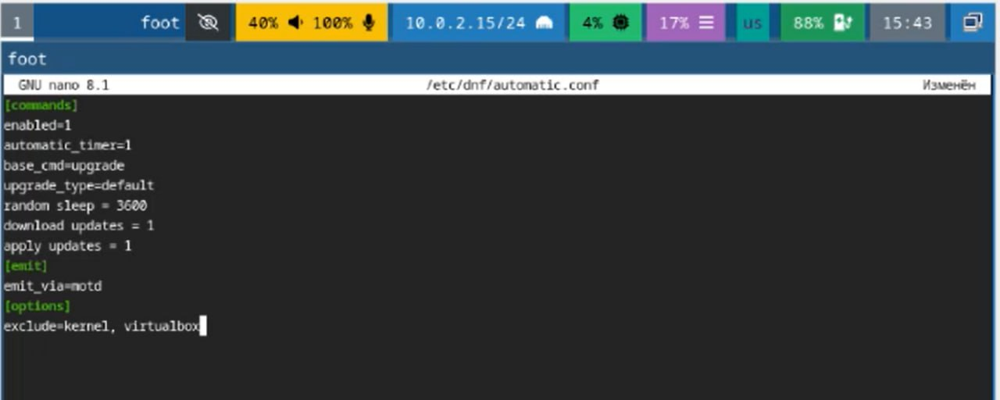
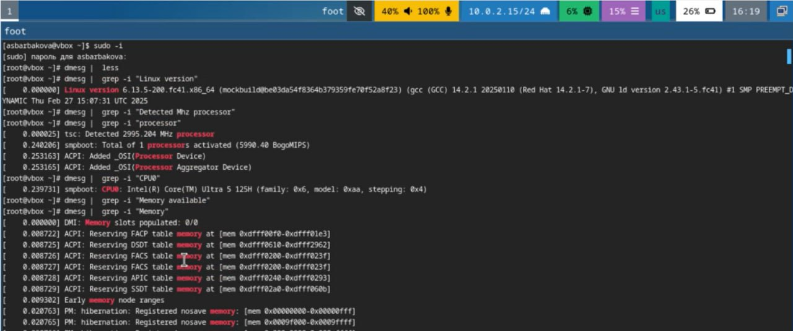

---
## Front matter
title: "Отчёт по лабораторной работе №1"
author: "Барбакова Алиса Саяновна"

## Generic otions
lang: ru-RU
toc-title: "Содержание"

## Bibliography
bibliography: bib/cite.bib
csl: pandoc/csl/gost-r-7-0-5-2008-numeric.csl

## Pdf output format
toc: true # Table of contents
toc-depth: 2
lof: true # List of figures
lot: true # List of tables
fontsize: 12pt
linestretch: 1.5
papersize: a4
documentclass: scrreprt
## I18n polyglossia
polyglossia-lang:
  name: russian
  options:
	- spelling=modern
	- babelshorthands=true
polyglossia-otherlangs:
  name: english
## I18n babel
babel-lang: russian
babel-otherlangs: english
## Fonts
mainfont: PT Serif
romanfont: PT Serif
sansfont: PT Sans
monofont: PT Mono
mainfontoptions: Ligatures=TeX
romanfontoptions: Ligatures=TeX
sansfontoptions: Ligatures=TeX,Scale=MatchLowercase
monofontoptions: Scale=MatchLowercase,Scale=0.9
## Biblatex
biblatex: true
biblio-style: "gost-numeric"
biblatexoptions:
  - parentracker=true
  - backend=biber
  - hyperref=auto
  - language=auto
  - autolang=other*
  - citestyle=gost-numeric
## Pandoc-crossref LaTeX customization
figureTitle: "Рис."
tableTitle: "Таблица"
listingTitle: "Листинг"
lofTitle: "Список иллюстраций"
lotTitle: "Список таблиц"
lolTitle: "Листинги"
## Misc options
indent: true
header-includes:
  - \usepackage{indentfirst}
  - \usepackage{float} # keep figures where there are in the text
  - \floatplacement{figure}{H} # keep figures where there are in the text
---

# Цель работы

Целью данной работы является приобретение практических навыков установки операционной системы на виртуальную машину, настройки минимально необходимых для дальнейшей работы сервисов.

# Задание

1)Запуск VirtualBox и создание новой виртуальной машины (операционная система Linux, Fedora).
2)Настройка установки ОС.
3)Перезапуск виртуальной машины и установка драйверов для VirtualBox.
4)Подключение образа диска дополнений гостевой ОС.
5)Установка необходимого ПО для создания документации.
6)Выполнение домашнего задания.

# Теоретическое введение

Что такое виртуальная машина?  
Виртуальная машина функционирует внутри вашего компьютера как отдельная физическая машина. Вы можете установить и запустить операционную систему так же, как и на реальном компьютере, поскольку она содержит собственное виртуальное оборудование, включая центральный процессор, графический процессор, память и хранилище. Самое приятное то, что вы можете запускать Linux, Windows и даже другие операционные системы одновременно на одном физическом компьютере, настроив более одной виртуальной машины. Вы можете запустить операционную систему Linux внутри операционной системы Windows, а затем запустить любую другую операционную систему в другой вкладке или даже запустить Windows в Linux, а затем запустить Linux поверх этого, если хотите. Возможности практически безграничны.

# Выполнение лабораторной работы

## Создание виртуальной машины

Я создаю новую виртуальную машину, указываем имя ASBarbakova. Делаю базовые настройки. (рис. [-@fig:00]1).

{#fig:001 width=70%}

Производим установку операционной системы. (рис. [-@fig:002]).

{#fig:002 width=70%}

## После установки

### Обновления

Вхожу в ОС под своей учетной записью. Открываю терминал, произвожу установку обновлений. (рис. [-@fig:003]).

{#fig:003 width=70%}

### Повышение комфорта работы. Отключение SELinux
Устанавливаю программу tmux. (рис. @fig:004). Запускаю tmux, открываю midnight commander, в файле /etc/selinux/config заменяю значение SELINUX=enforcing на SELINUX=permissive (рис. [-@fig:004]).

{#fig:004 width=70%}

Перегружаю виртуальную машину.

## Настройка раскладки клавиатуры
Создаю конфигурационный файл ~/.config/sway/config.d/95-system-keyboard-config и редактирую его, добавляя строчку exec_always /usr/libexec/sway-systemd/locale1-xkb-config --oneshot  

Также редактирую конфигурационный файл /etc/X11/xorg.conf.d/00-keyboard.conf. Перегружаю виртуальную машину. (рис. [-@fig:005]). 

{#fig:005 width=70%}

## Автоматическое обновление

Установливаю ПО для автоматического обновления (рис. [-@fig:006]).

{#fig:006 width=70%}

Редактирую необходимый конфигурационный файл, запускаю таймер. (рис. [-@fig:007]).

{#fig:007 width=70%}

## Установка программного обеспечения для создания документации

Скачиваю pandoc и texlive на виртуальную машину (рис. [-@fig:008]).

{#fig:008 width=70%} 

## Домашнее задание

С помощью ввода в терминал команды dmesg | less, отвечаю на вопросы и выполняю домашнее задание (рис. [-@fig:009]). (рис. [-@fig:010]).

{#fig:009 width=70%}

{#fig:010 width=70%}

# Выводы

В результате выполнения лабораторной работы я приобрела навыки установки операционной системы на виртуальную машину, а также настройки минимально необходимых для дальнейшей работы сервисов.

# Список литературы{.unnumbered}

1) Кулябов Д. С. Введерние в операционную систему UNIX - Лекция.
2) Таненбаум Э., Бос Х. Современные операционные системы. - 4-е изд. -СПб. : Питер, 2015. - 1120 с.
