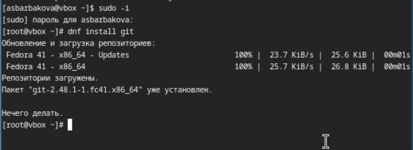
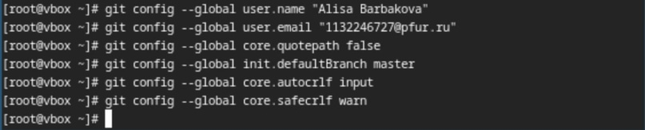
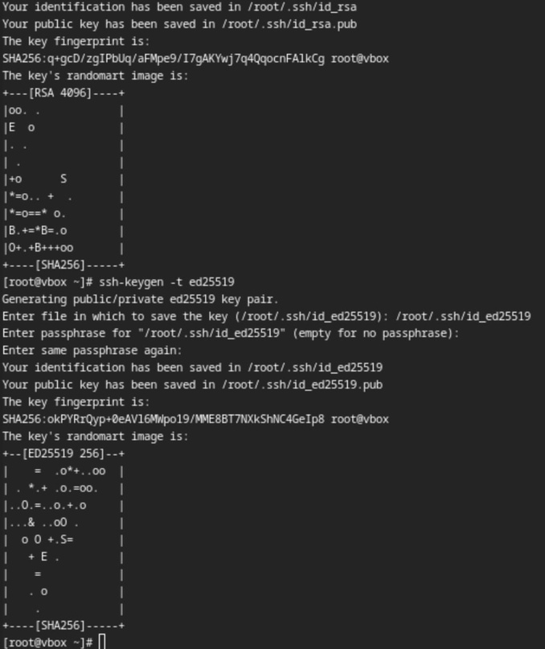
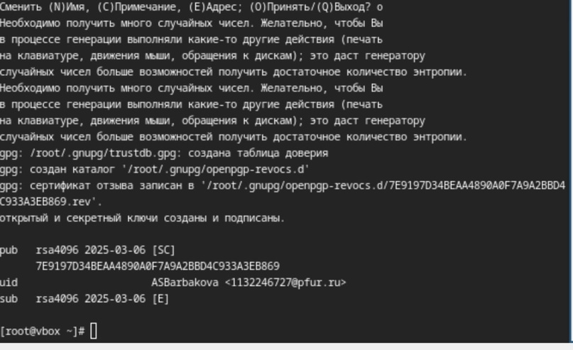
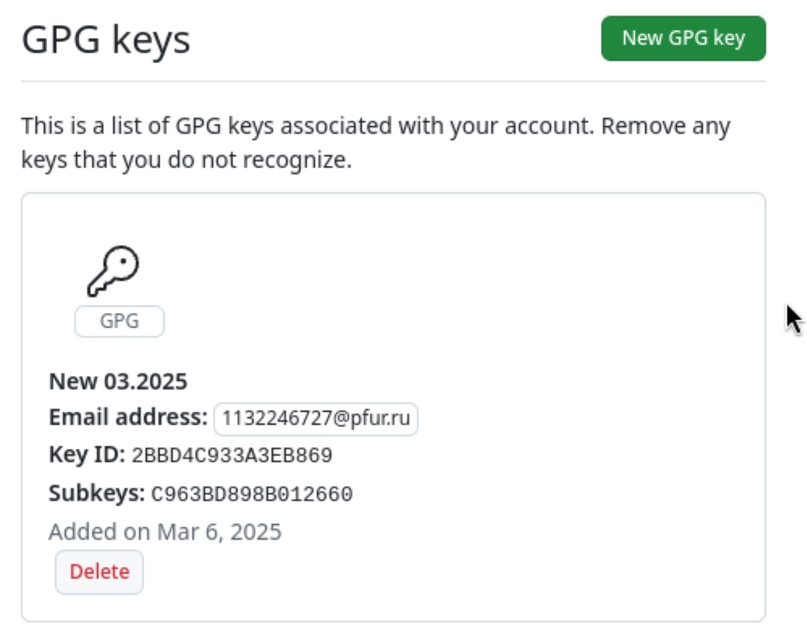
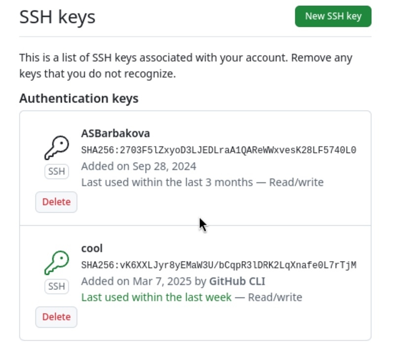
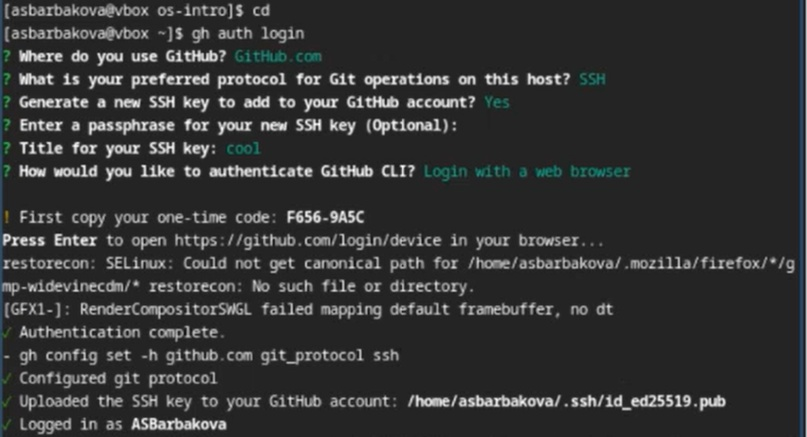
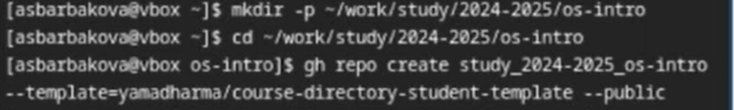
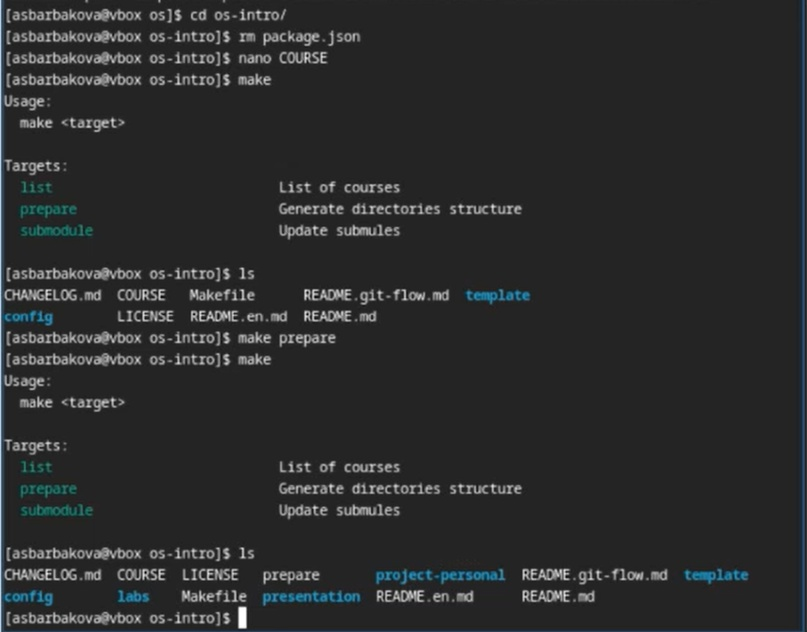
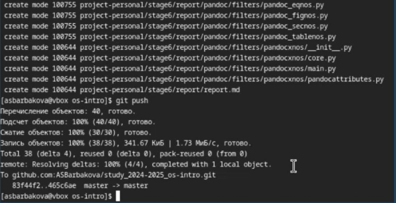

---
## Front matter
lang: ru-RU
title: Лабораторная работа №2
author: Барбакова А. С.
  - 
institute:
  - Российский университет дружбы народов, Москва, Россия
  
## i18n babel
babel-lang: russian
babel-otherlangs: english

## Formatting pdf
toc: false
toc-title: Содержание
slide_level: 2
aspectratio: 169
section-titles: true
theme: metropolis
header-includes:
 - \metroset{progressbar=frametitle,sectionpage=progressbar,numbering=fraction}
 - '\makeatletter'
 - '\beamer@ignorenonframefalse'
 - '\makeatother'
---

# Информация

## Докладчик

:::::::::::::: {.columns align=center}
::: {.column width="70%"}

  * Барбакова Алиса Саяновна
  * НКАбд-01-24, студ. билет - 1132246727
  * Российский университет дружбы народов
  * https://github.com/ASBarbakova/study_2024-2025_os-intro

:::

:::
::::::::::::::

# Выполнение лабораторной работы №2

## Цель работы

- Изучить идеологию и применение средств контроля версий  
- Освоить умения по работе с git

## Задачи

1. Создать базовую конфигурацию для работы с git.  
2. Создать ключ SSH.  
3. Создать ключ PGP.  
4. Настроить подписи git.  
5. Зарегистрироваться на Github.  
6. Создать локальный каталог для выполнения заданий по предмету.  

## Теоретическое введение

Системы контроля версий (Version Control System, VCS) применяются при работе нескольких человек над одним проектом. Обычно основное дерево проекта хранится в локальном или удалённом репозитории, к которому настроен доступ для участников проекта. При внесении изменений в содержание проекта система контроля версий позволяет их фиксировать, совмещать изменения, произведённые разными участниками проекта, производить откат к любой более ранней версии проекта, если это требуется.В классических системах контроля версий используется централизованная модель, предполагающая наличие единого репозитория для хранения файлов. Выполнение большинства функций по управлению версиями осуществляется специальным сервером. Участник проекта (пользователь) перед началом работы посредством определённых команд получает нужную ему версию файлов. После внесения изменений, пользователь размещает новую версию в хранилище. При этом предыдущие версии не удаляются из центрального хранилища и к ним можно вернуться в любой момент. 

##

Сервер может сохранять не полную версию изменённых файлов, а производить так называемую дельта-компрессию — сохранять только изменения между последовательными версиями, что позволяет уменьшить объём хранимых данных.Системы контроля версий поддерживают возможность отслеживания и разрешения конфликтов, которые могут возникнуть при работе нескольких человек над одним файлом. Можно объединить (слить) изменения, сделанные разными участниками (автоматически или вручную), вручную выбрать нужную версию, отменить изменения вовсе или заблокировать файлы для изменения. В зависимости от настроек блокировка не позволяет другим пользователям получить рабочую копию или препятствует изменению рабочей копии файла средствами файловой системы ОС, обеспечивая таким образом, привилегированный доступ только одному пользователю, работающему с файлом.Системы контроля версий также могут обеспечивать дополнительные, более гибкие функциональные возможности. Например, они могут поддерживать работу с несколькими версиями одного файла, сохраняя общую историю изменений до точки ветвления версий и
собственные истории изменений каждой ветви. Кроме того, обычно доступна информация о том, кто из участников, когда и какие изменения вносил. Обычно такого рода информация хранится в журнале изменений, доступ к которому можно ограничить.В отличие от классических, в распределённых системах контроля версий центральный репозиторий не является обязательным.Среди классических VCS наиболее известны CVS, Subversion, а среди распределённых — Git, Bazaar, Mercurial. Принципы их работы схожи, отличаются они в основном синтаксисом используемых в работе команд. 

## Установка программного обеспечения

Устанавливаю git gh

{#fig:001 width=70%}

## Базовая настройка git

Задаю свои имя и почту.  
Настраивую utf-8, задаю имя начальной ветки, 
устанавливаю параметр autocrlf и safecrlf

{#fig:002 width=70%}

## Создание ключей ssh

Ввожу команды, устанавливаю ключи ssh

{#fig:003 width=70%}

## Создайте ключи pgp

Генерирую ключ, отвечаю на вопросы

{#fig:004 width=70%} 

## Настройка github

Учетная запись на гитхаб уже была создана.

## Добавление PGP ключа в Github

Копирую отпечаток приватного ключа, перехожу на гитхаб и прикрепляю ключ в нужных настройках.

{#fig:005 width=60%}

## 

{#fig:006 width=70%}

## Настройка gh

Авторизовываюсь через терминал и браузер на gh.

{#fig:008 width=70%}

# Создание репозитория курса на основе шаблона

Создаю репозиторий курса.

{#fig:009 width=70%}

Настраиваю и компилирую файлы.

{#fig:010 width=70%}

## 

Отправляю всё на github с помощью git push.

{#fig:011 width=70%}

## Выводы
В ходе данной лабораторной работы я изучила идеологию и применения средств контроля версий, освоила умения по работе с git.

## Список литературы{.unnumbered}

1. [Лабораторная №2](https://esystem.rudn.ru/mod/page/view.php?id=1224371#org32d97ca)
