---
## Front matter
lang: ru-RU
title: Лабораторная работа №6
author: Барбакова А. С.
  - 
institute:
  - Российский университет дружбы народов, Москва, Россия
  
## i18n babel
babel-lang: russian
babel-otherlangs: english

## Formatting pdf
toc: false
toc-title: Содержание
slide_level: 2
aspectratio: 169
section-titles: true
theme: metropolis
header-includes:
 - \metroset{progressbar=frametitle,sectionpage=progressbar,numbering=fraction}
 - '\makeatletter'
 - '\beamer@ignorenonframefalse'
 - '\makeatother'
---

# Информация

## Докладчик

:::::::::::::: {.columns align=center}
::: {.column width="70%"}

  * Барбакова Алиса Саяновна
  * НКАбд-01-24, студ. билет - 1132246727
  * Российский университет дружбы народов
  * https://github.com/ASBarbakova/study_2024-2025_os-intro

:::

:::
::::::::::::::

# Цель работы
Приобретение практических навыков взаимодействия пользователя с системой посредством командной строки.

# Задание

1. Определите полное имя вашего домашнего каталога. Далее относительно этого ката-
лога будут выполняться последующие упражнения.
2. Выполните следующие действия:
2.1. Перейдите в каталог /tmp.  
2.2. Выведите на экран содержимое каталога /tmp. Для этого используйте команду ls с различными опциями. Поясните разницу в выводимой на экран информации.  
2.3. Определите, есть ли в каталоге /var/spool подкаталог с именем cron?  
2.4. Перейдите в Ваш домашний каталог и выведите на экран его содержимое. Определите, кто является владельцем файлов и подкаталогов?  
3. Выполните следующие действия:
3.1. В домашнем каталоге создайте новый каталог с именем newdir.  
3.2. В каталоге ~/newdir создайте новый каталог с именем morefun.  
3.3. В домашнем каталоге создайте одной командой три новых каталога с именами letters, memos, misk. Затем удалите эти каталоги одной командой.  
3.4. Попробуйте удалить ранее созданный каталог ~/newdir командой rm. Проверьте, был ли каталог удалён.  
3.5. Удалите каталог ~/newdir/morefun из домашнего каталога. Проверьте, был ли каталог удалён.  

##

4. С помощью команды man определите, какую опцию команды ls нужно использовать для просмотра содержимое не только указанного каталога, но и подкаталогов, входящих в него.  
5. С помощью команды man определите набор опций команды ls, позволяющий отсортировать по времени последнего изменения выводимый список содержимого каталога с развёрнутым описанием файлов.  
6. Используйте команду man для просмотра описания следующих команд: cd, pwd, mkdir,rmdir, rm. Поясните основные опции этих команд.
7. Используя информацию, полученную при помощи команды history, выполните модификацию и исполнение нескольких команд из буфера команд.

# Теоретическое введение

В операционной системе типа Linux взаимодействие пользователя с системой обычно осуществляется с помощью командной строки посредством построчного ввода команд. При этом обычно используется командные интерпретаторы языка shell: /bin/sh; /bin/csh; /bin/ksh. Формат команды. Командой в операционной системе называется записанный по специальным правилам текст (возможно с аргументами), представляющий собой указание на выполнение какой-либо функций (или действий) в операционной системе.Обычно первым словом идёт имя команды, остальной текст — аргументы или опции, конкретизирующие действие. Общий формат команд можно представить следующим образом: <имя_команды><разделитель><аргументы>

# Выполнение лабораторной работы

## Имя домашнего каталога

1. Определим полное имя домашнего каталога. Перейдем в каталог /tmp. Выведем на экран содержимое каталога /tmp. Для этого используем команду ls с различными опциями.

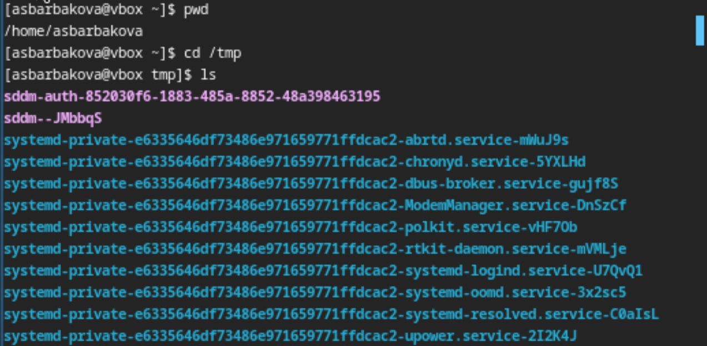{#fig:001 width=70%}

##

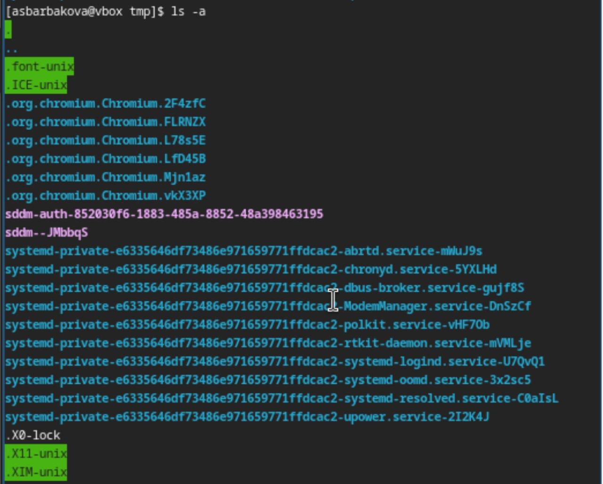{#fig:002 width=70%}

##

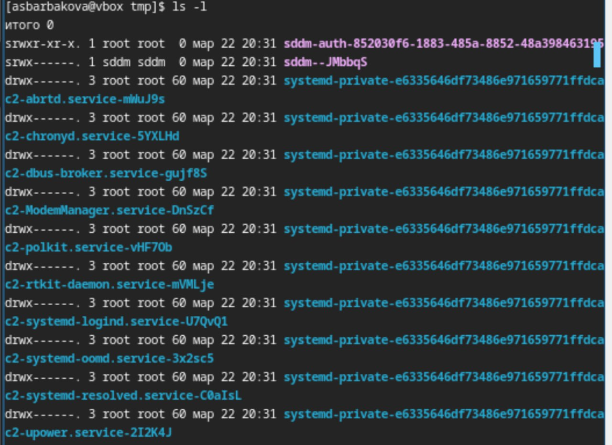{#fig:003 width=70%}

##

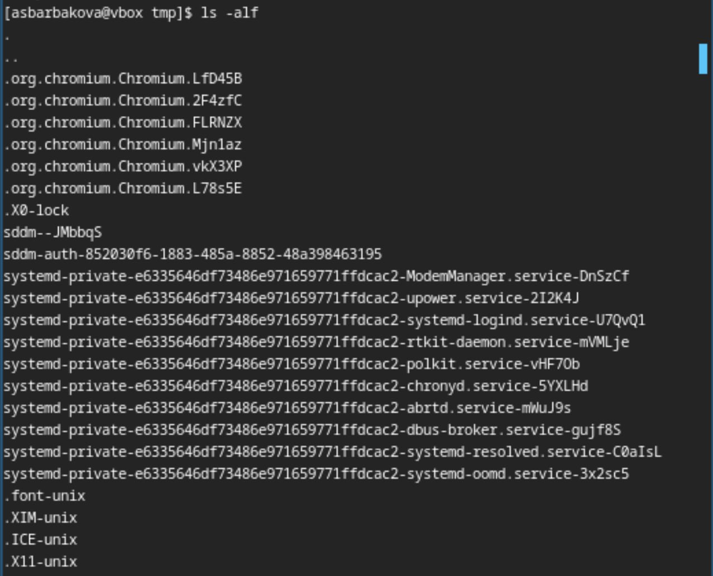{#fig:004 width=70%}

## /var/spool

3. Определим, есть ли в каталоге /var/spool подкаталог с именем cron. Он есть.

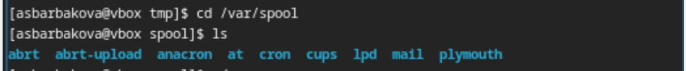{#fig:005 width=70%}

## Содержимое домашнего каталога

4.  Перейду в домашний каталог и выведу на экран его содержимое. Владелица файлов - я.

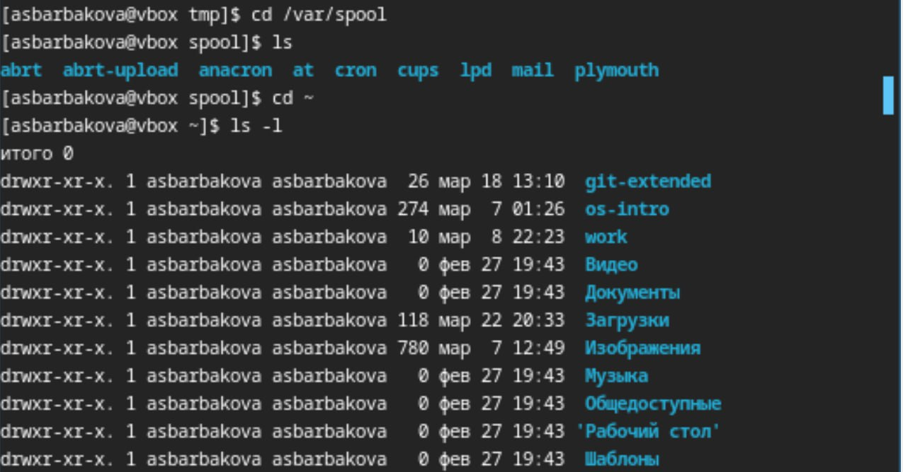{#fig:006 width=70%}

## Новый каталог

5. В домашнем каталоге создадим новый каталог с именем newdir. В каталоге ~/newdir создадим новый каталог с именем morefun.

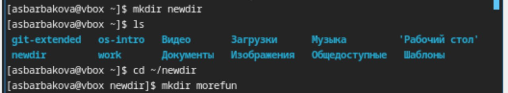{#fig:007 width=70%} 

## Удаление и создание каталогов одной командой

6.  В том же каталоге создадим одной командой три новых каталога с именами
letters, memos, misk. Затем удалим эти каталоги.

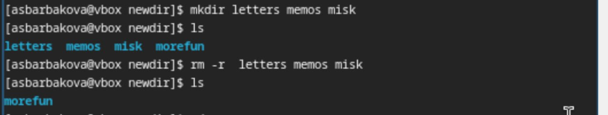{#fig:008 width=70%} 

## Удаление каталога ~/newdir

7. Пробую удалить каталог ~/newdir/morefun из домашнего каталога. Он не удалился.  

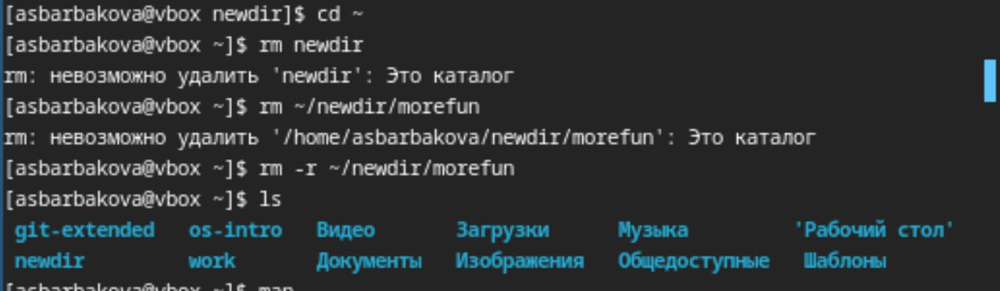{#fig:009 width=70%}

## Использование команды man с ls 

8.  С помощью команды man определим, какую опцию команды ls нужно использовать для просмотра содержимое указанного каталога и подкаталогов, входящих в него.

{#fig:010 width=70%} 

## Использование команды man с ls 

С помощью команды man определим набор опций команды ls, позволяющий отсортировать по времени последнего изменения выводимый список содержимого каталога с развёрнутым описанием файлов.
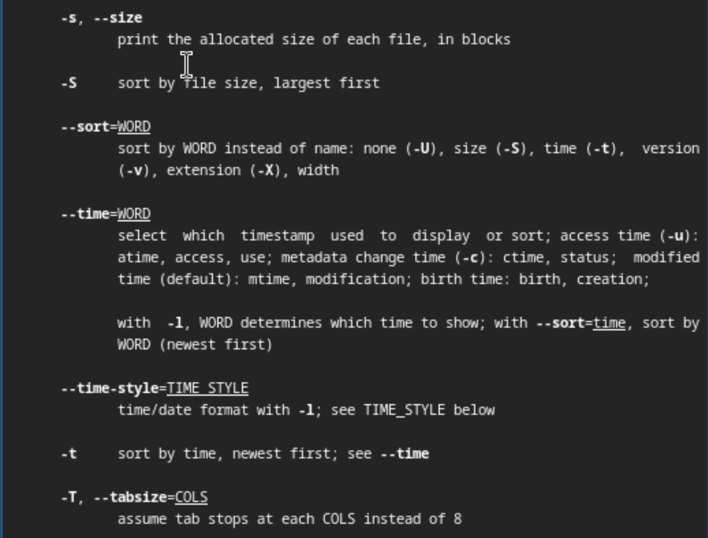{#fig:011 width=70%} 

## Команда man с разными командами

9.  Используtv команду man для просмотра описания следующих команд: cd, pwd, mkdir,
rmdir, rm.

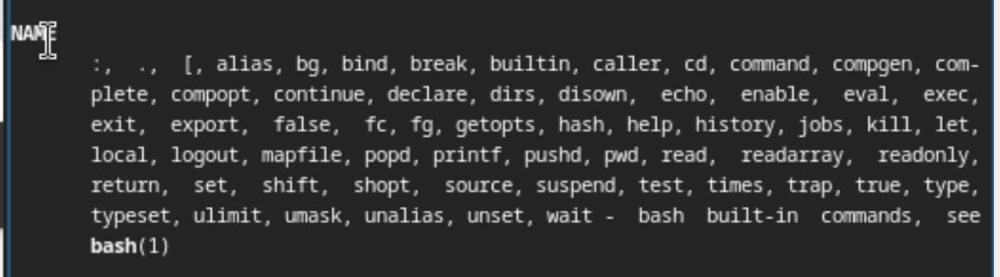{#fig:012 width=70%} 

##

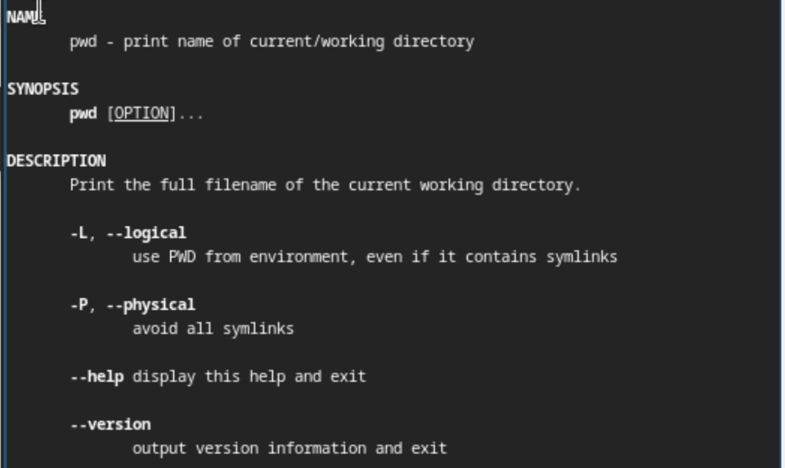{#fig:013 width=70%} 

##

{#fig:014 width=70%} 

##

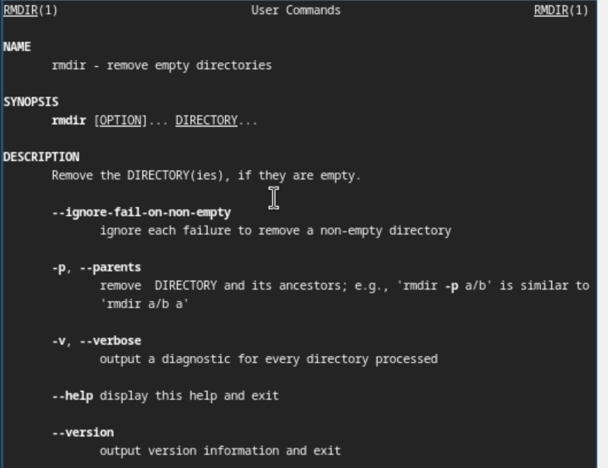{#fig:015 width=70%} 

##

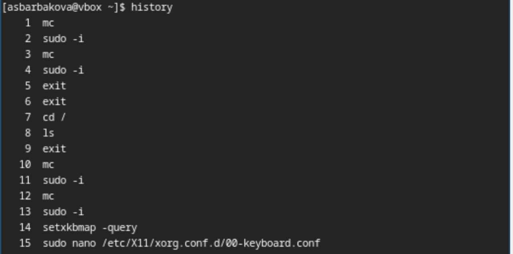{#fig:115 width=70%} 

## Моя история команд

10. Используя информацию, полученную при помощи команды history, выполним мо-
дификацию и исполнение нескольких команд из буфера команд.
{#fig:016 width=70%} 

## Модификация

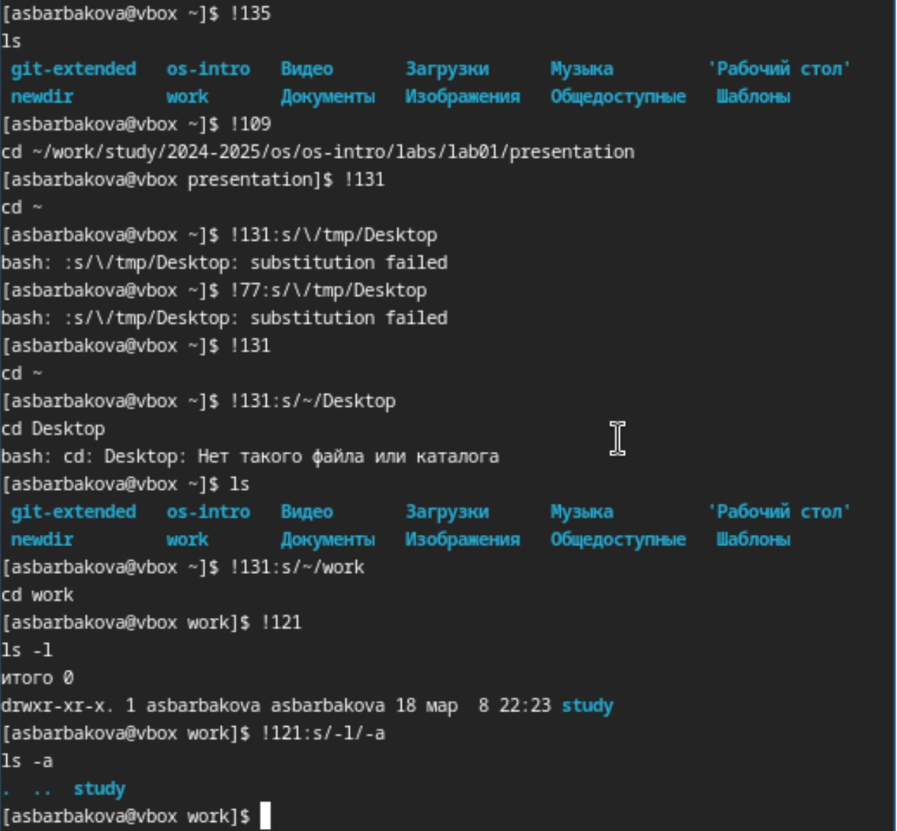{#fig:017 width=70%}

# Вывод

В ходе данной лабораторной работы я приобрела практические навыки взаимодействия с системой посредством командной строки.

# Список литературы{.unnumbered}

1. Кулябов Д. С. Введерние в операционную систему UNIX - Лекция.
2. Таненбаум Э., Бос Х. Современные операционные системы. - 4-е изд. -СПб. : Питер, 2015. - 1120 с.
