---
## Front matter
title: "Лабораторная №6"
author: "Барбакова Алиса Саяновна"

## Generic otions
lang: ru-RU
toc-title: "Содержание"

## Bibliography
bibliography: bib/cite.bib
csl: pandoc/csl/gost-r-7-0-5-2008-numeric.csl

## Pdf output format
toc: true # Table of contents
toc-depth: 2
lof: true # List of figures
lot: true # List of tables
fontsize: 12pt
linestretch: 1.5
papersize: a4
documentclass: scrreprt
## I18n polyglossia
polyglossia-lang:
  name: russian
  options:
	- spelling=modern
	- babelshorthands=true
polyglossia-otherlangs:
  name: english
## I18n babel
babel-lang: russian
babel-otherlangs: english
## Fonts
mainfont: PT Serif
romanfont: PT Serif
sansfont: PT Sans
monofont: PT Mono
mainfontoptions: Ligatures=TeX
romanfontoptions: Ligatures=TeX
sansfontoptions: Ligatures=TeX,Scale=MatchLowercase
monofontoptions: Scale=MatchLowercase,Scale=0.9
## Biblatex
biblatex: true
biblio-style: "gost-numeric"
biblatexoptions:
  - parentracker=true
  - backend=biber
  - hyperref=auto
  - language=auto
  - autolang=other*
  - citestyle=gost-numeric
## Pandoc-crossref LaTeX customization
figureTitle: "Рис."
tableTitle: "Таблица"
listingTitle: "Листинг"
lofTitle: "Список иллюстраций"
lotTitle: "Список таблиц"
lolTitle: "Листинги"
## Misc options
indent: true
header-includes:
  - \usepackage{indentfirst}
  - \usepackage{float} # keep figures where there are in the text
  - \floatplacement{figure}{H} # keep figures where there are in the text
---

# Цель работы
Приобретение практических навыков взаимодействия пользователя с системой посредством командной строки.

# Задание

1. Определите полное имя вашего домашнего каталога. Далее относительно этого ката-
лога будут выполняться последующие упражнения.
2. Выполните следующие действия:
2.1. Перейдите в каталог /tmp.  
2.2. Выведите на экран содержимое каталога /tmp. Для этого используйте команду ls с различными опциями. Поясните разницу в выводимой на экран информации.  
2.3. Определите, есть ли в каталоге /var/spool подкаталог с именем cron?  
2.4. Перейдите в Ваш домашний каталог и выведите на экран его содержимое. Определите, кто является владельцем файлов и подкаталогов?  
3. Выполните следующие действия:
3.1. В домашнем каталоге создайте новый каталог с именем newdir.  
3.2. В каталоге ~/newdir создайте новый каталог с именем morefun.  
3.3. В домашнем каталоге создайте одной командой три новых каталога с именами letters, memos, misk. Затем удалите эти каталоги одной командой.  
3.4. Попробуйте удалить ранее созданный каталог ~/newdir командой rm. Проверьте, был ли каталог удалён.  
3.5. Удалите каталог ~/newdir/morefun из домашнего каталога. Проверьте, был ли каталог удалён.  
4. С помощью команды man определите, какую опцию команды ls нужно использовать для просмотра содержимое не только указанного каталога, но и подкаталогов, входящих в него.  
5. С помощью команды man определите набор опций команды ls, позволяющий отсортировать по времени последнего изменения выводимый список содержимого каталога с развёрнутым описанием файлов.  
6. Используйте команду man для просмотра описания следующих команд: cd, pwd, mkdir,rmdir, rm. Поясните основные опции этих команд.
7. Используя информацию, полученную при помощи команды history, выполните модификацию и исполнение нескольких команд из буфера команд.

# Теоретическое введение

В операционной системе типа Linux взаимодействие пользователя с системой обычно осуществляется с помощью командной строки посредством построчного ввода команд. При этом обычно используется командные интерпретаторы языка shell: /bin/sh; /bin/csh; /bin/ksh. Формат команды. Командой в операционной системе называется записанный по специальным правилам текст (возможно с аргументами), представляющий собой указание на выполнение какой-либо функций (или действий) в операционной системе.Обычно первым словом идёт имя команды, остальной текст — аргументы или опции, конкретизирующие действие. Общий формат команд можно представить следующим образом: <имя_команды><разделитель><аргументы>

# Выполнение лабораторной работы

1. Определим полное имя домашнего каталога. Перейдем в каталог /tmp. Выведем на экран содержимое каталога /tmp. Для этого используем команду ls с различными опциями. Для
того, чтобы отобразить имена скрытых файлов, необходимо использовать команду ls с опцией a. Чтобы вывести на экран подробную информацию о файлах и каталогах, необходимо
использовать опцию l. (рис. [-@fig:001]). (рис. [-@fig:002]). (рис. [-@fig:003]). (рис. [-@fig:004])

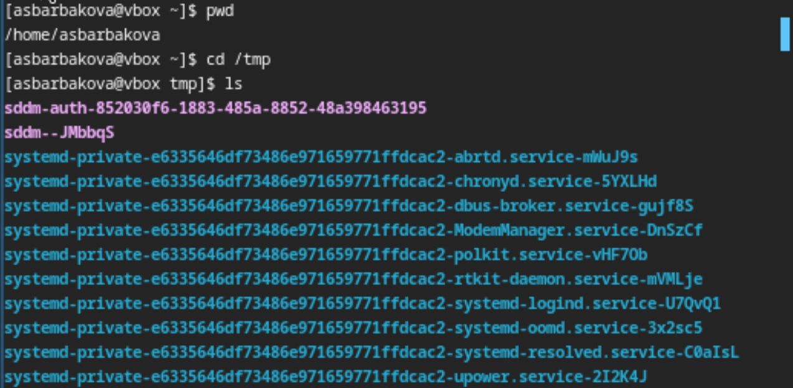{#fig:001 width=70%}

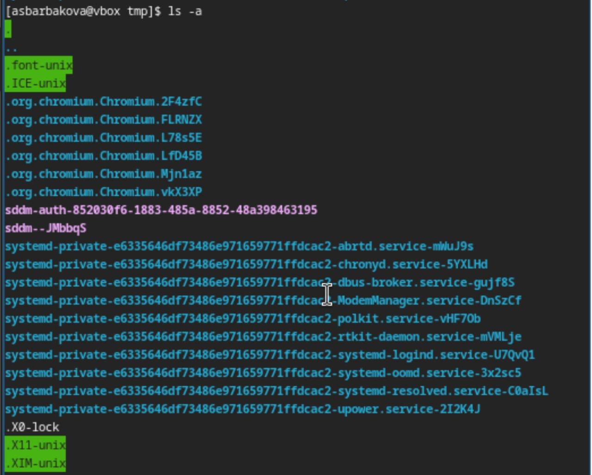{#fig:002 width=70%}

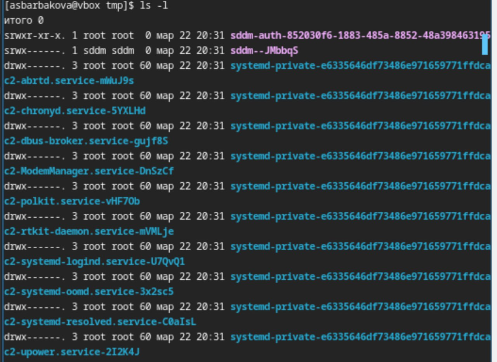{#fig:003 width=70%}

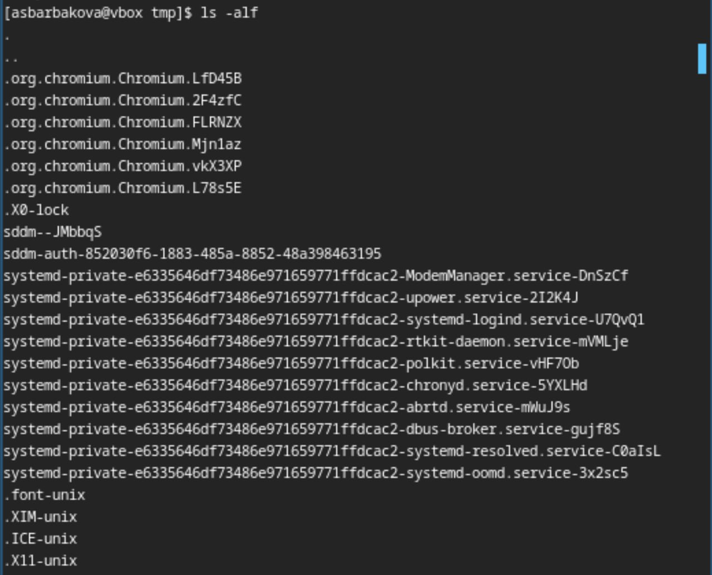{#fig:004 width=70%}

3. Определим, есть ли в каталоге /var/spool подкаталог с именем cron. Он есть. (рис. [-@fig:005]).

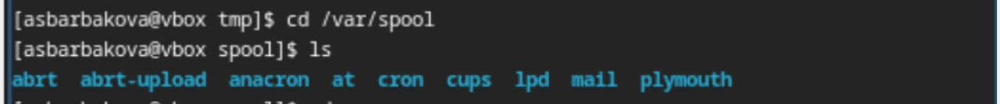{#fig:005 width=70%}

4.  Перейдите в Ваш домашний каталог и выведите на экран его содержимое. Владелица файлов - я. (рис. [-@fig:006]). 

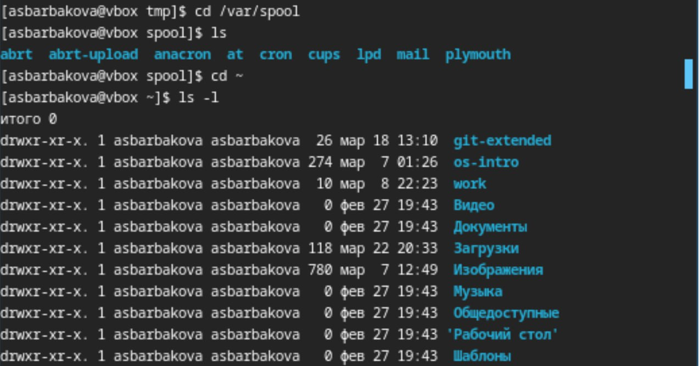{#fig:006 width=70%}

5. В домашнем каталоге создадим новый каталог с именем newdir. В каталоге ~/newdir создадим новый каталог с именем morefun.(рис. [-@fig:007]).

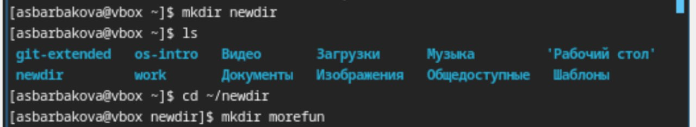{#fig:007 width=70%} 

6.  В том же каталоге создадим одной командой три новых каталога с именами
letters, memos, misk. Затем удалим эти каталоги(рис. [-@fig:008]). 

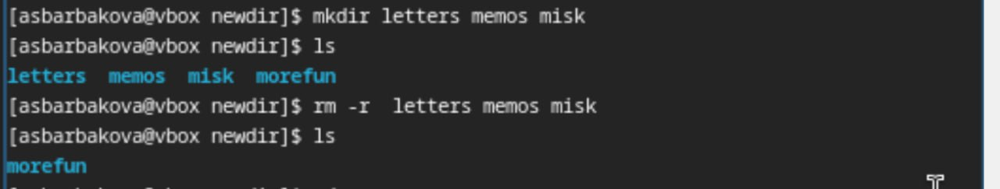{#fig:008 width=70%} 

7.  Попробуем удалить ранее созданный каталог ~/newdir командой rm. Проверим,
был ли каталог удалён. Удалим каталог ~/newdir/morefun из домашнего каталога. Он не удалился. (рис. [-@fig:009]).  

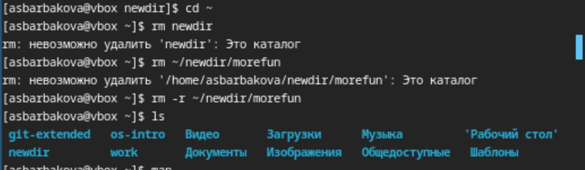{#fig:009 width=70%}

8.  С помощью команды man определим, какую опцию команды ls нужно использовать для просмотра содержимое не только указанного каталога, но и подкаталогов,
входящих в него. С помощью команды man определим набор опций команды ls, позволяющий отсортировать по времени последнего изменения выводимый список содержимого каталога с развёрнутым описанием файлов. (рис. [-@fig:010]). (рис. [-@fig:011]). 

{#fig:010 width=70%} 

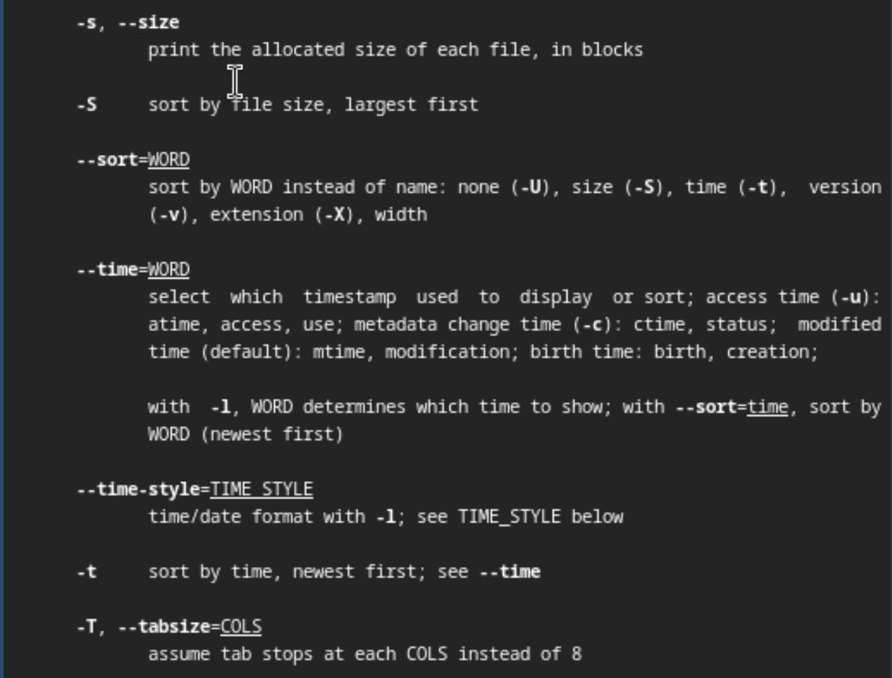{#fig:011 width=70%} 

9.  Используtv команду man для просмотра описания следующих команд: cd, pwd, mkdir,
rmdir, rm. (рис. [-@fig:012]). (рис. [-@fig:013]). (рис. [-@fig:014]). (рис. [-@fig:015]). (рис. [-@fig:115]). 

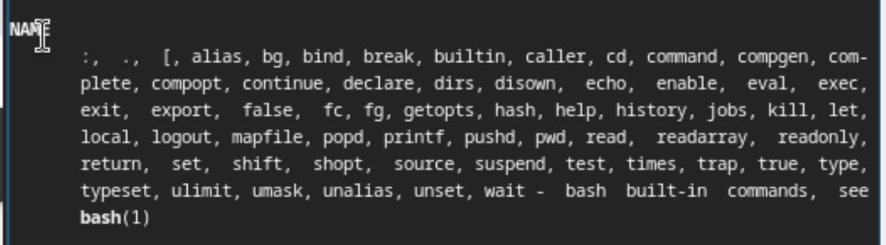{#fig:012 width=70%} 

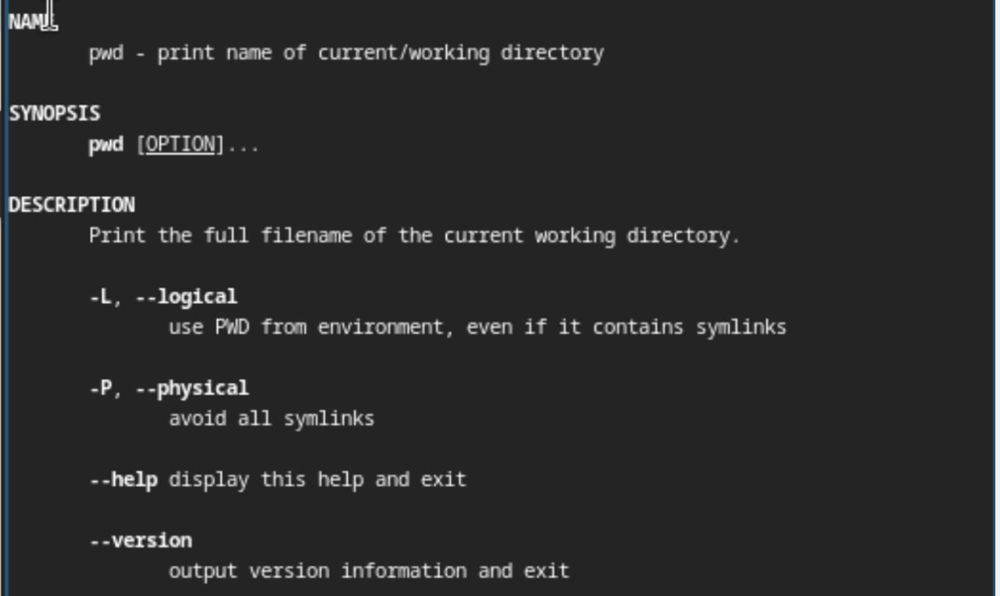{#fig:013 width=70%} 

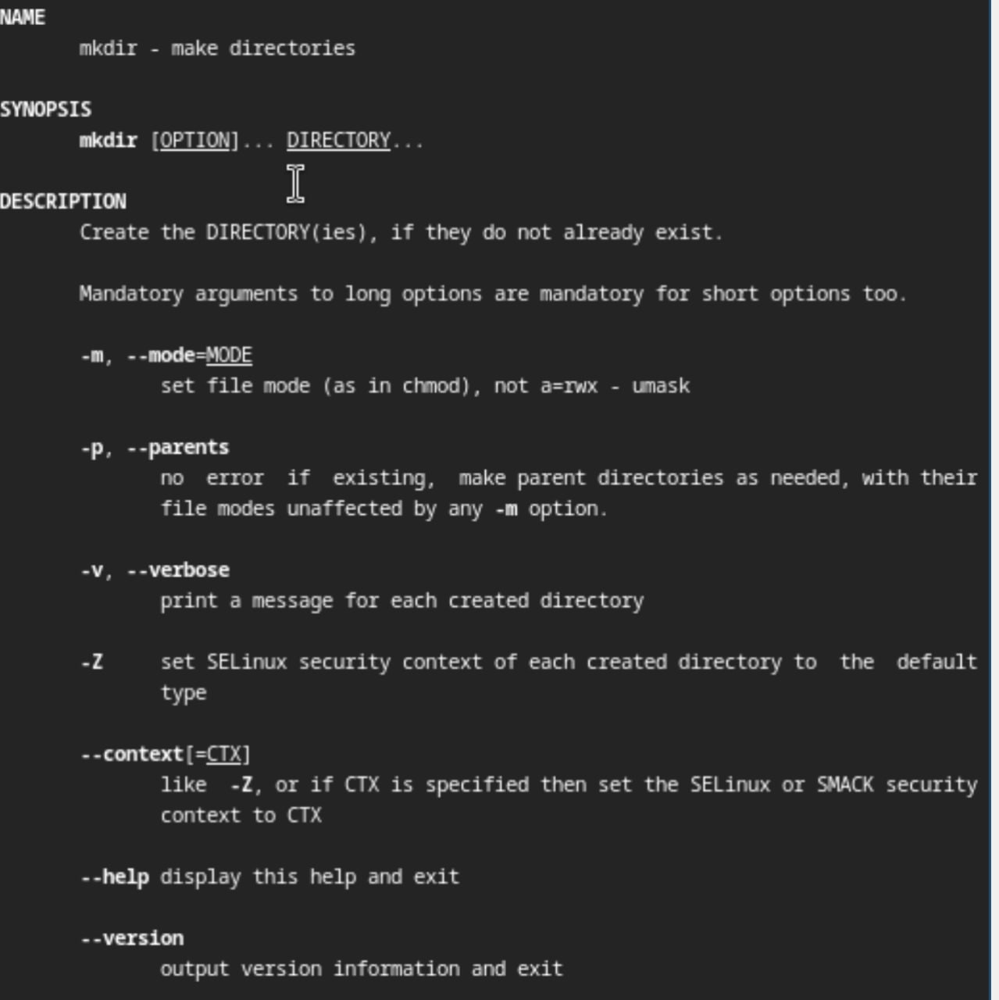{#fig:014 width=70%} 

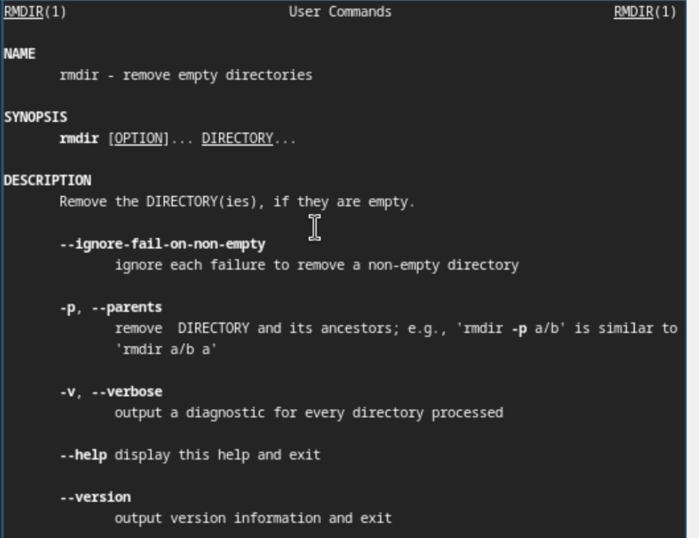{#fig:015 width=70%} 

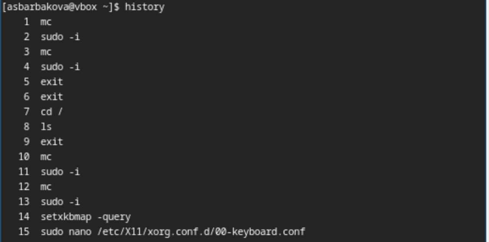{#fig:115 width=70%} 

10. Используя информацию, полученную при помощи команды history, выполним мо-
дификацию и исполнение нескольких команд из буфера команд. (рис. [-@fig:016]).  (рис. [-@fig:017]). 

{#fig:016 width=70%} 

{#fig:017 width=70%}

# Вывод
В ходе данной лабораторной работы я приобрела практические навыки взаимодействия с системой посредством командной строки.

# Список литературы{.unnumbered}

1. Кулябов Д. С. Введерние в операционную систему UNIX - Лекция.
2. Таненбаум Э., Бос Х. Современные операционные системы. - 4-е изд. -СПб. : Питер, 2015. - 1120 с.
