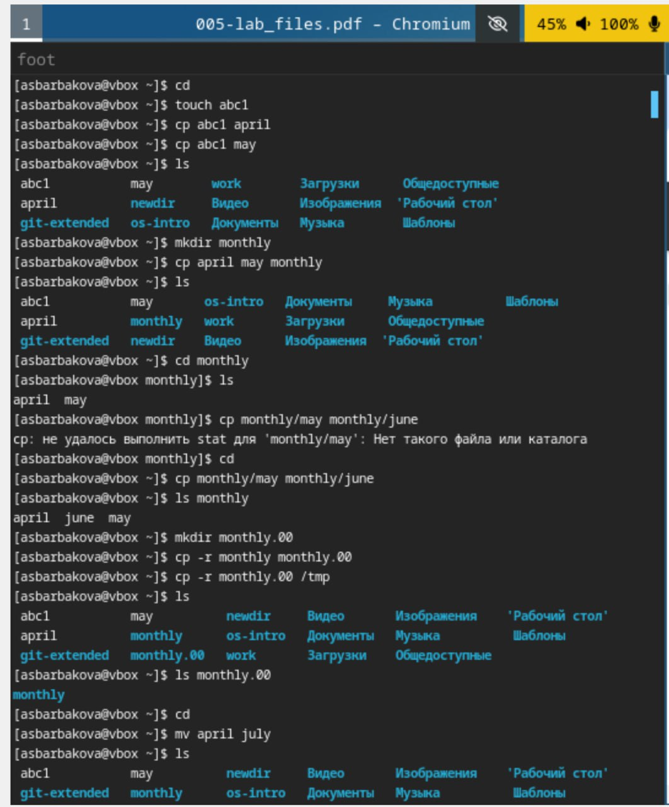
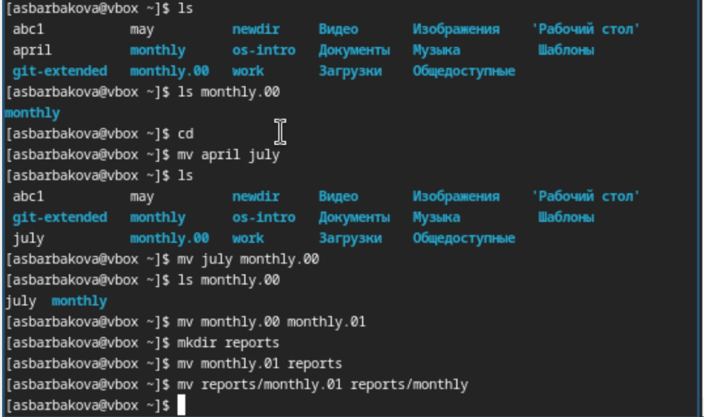
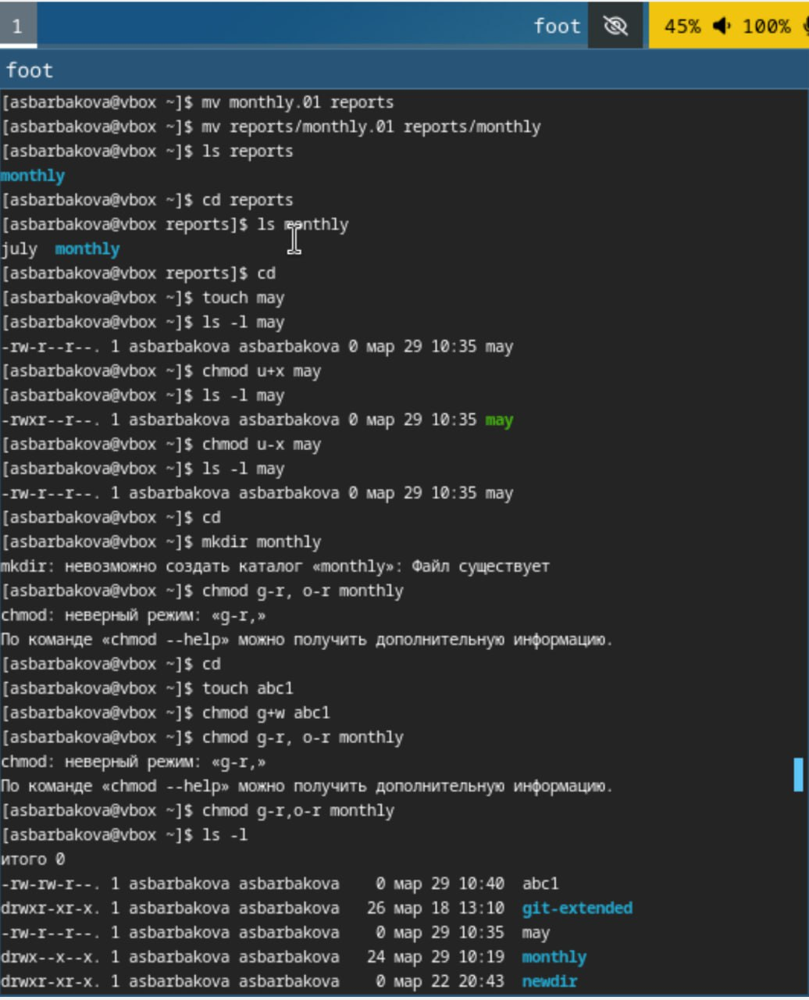
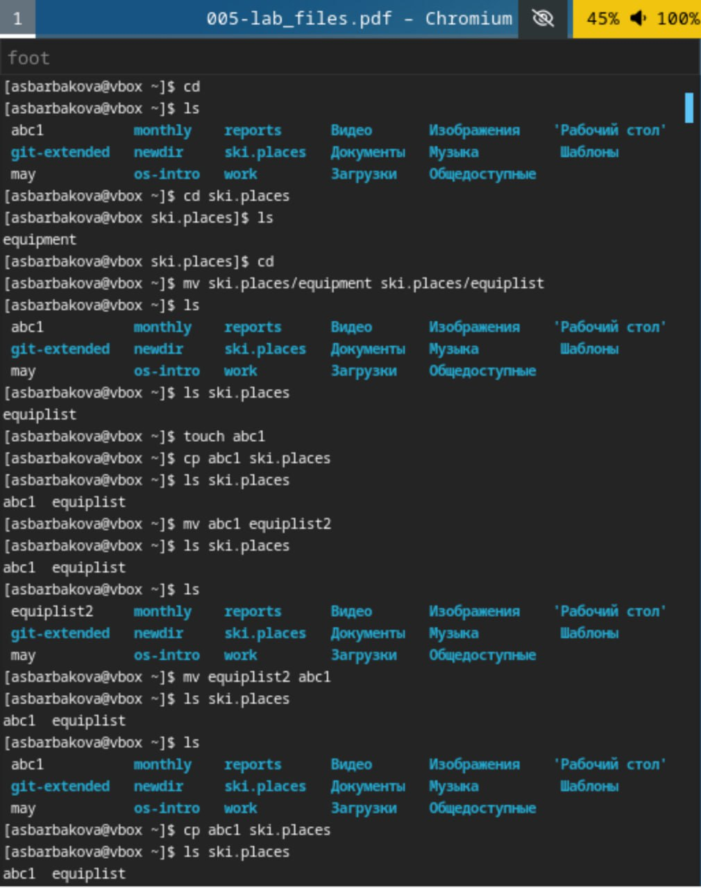
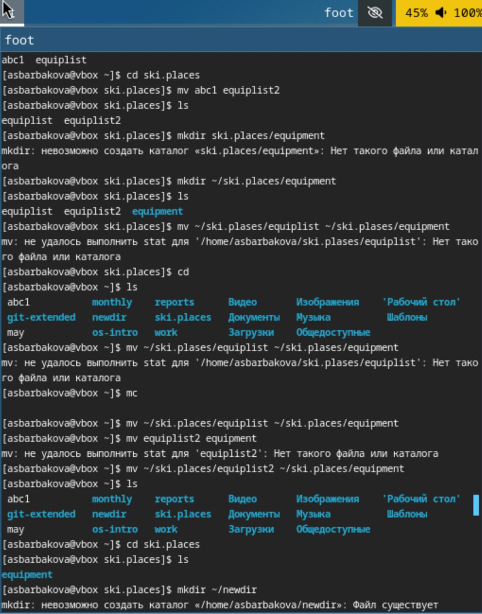
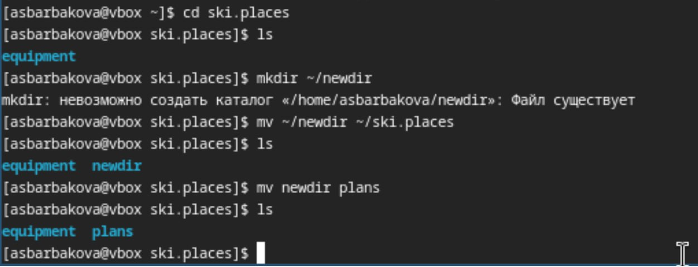

---
## Front matter
lang: ru-RU
title: Лабораторная работа №7
author: Барбакова А. С.
  - 
institute:
  - Российский университет дружбы народов, Москва, Россия
  
## i18n babel
babel-lang: russian
babel-otherlangs: english

## Formatting pdf
toc: false
toc-title: Содержание
slide_level: 2
aspectratio: 169
section-titles: true
theme: metropolis
header-includes:
 - \metroset{progressbar=frametitle,sectionpage=progressbar,numbering=fraction}
 - '\makeatletter'
 - '\beamer@ignorenonframefalse'
 - '\makeatother'
---

# Информация

## Докладчик

:::::::::::::: {.columns align=center}
::: {.column width="70%"}

  * Барбакова Алиса Саяновна
  * НКАбд-01-24, студ. билет - 1132246727
  * Российский университет дружбы народов
  * https://github.com/ASBarbakova/study_2024-2025_os-intro

:::
::: {.column width="30%"}

:::
::::::::::::::

# Цель работы

Ознакомление с файловой системой Linux, её структурой, именами и содержанием
каталогов. Приобретение практических навыков по применению команд для работы
с файлами и каталогами, по управлению процессами (и работами), по проверке использования диска и обслуживанию файловой системы.

# Задание  
1. Выполните все примеры, приведённые в первой части описания лабораторной работы.  
2. Выполните следующие действия, зафиксировав в отчёте по лабораторной работе  
используемые при этом команды и результаты их выполнения:
- Скопируйте файл /usr/include/sys/io.h в домашний каталог и назовите его
equipment. Если файла io.h нет, то используйте любой другой файл в каталоге
/usr/include/sys/ вместо него.  
- В домашнем каталоге создайте директорию ~/ski.plases.  
- Переместите файл equipment в каталог ~/ski.plases.  

##

- Переименуйте файл ~/ski.plases/equipment в ~/ski.plases/equiplist.  
- Создайте в домашнем каталоге файл abc1 и скопируйте его в каталог
~/ski.plases, назовите его equiplist2.  
- Создайте каталог с именем equipment в каталоге ~/ski.plases.  
- Переместите файлы ~/ski.plases/equiplist и equiplist2 в каталог
~/ski.plases/equipment.  
- Создайте и переместите каталог ~/newdir в каталог ~/ski.plases и назовите
его plans.  

# Теоретическое введение

Файловая система в Linux состоит из фалов и каталогов. Каждому физическому носителю соответствует своя файловая система. Существует несколько типов файловых систем. Перечислим наиболее часто встречающиеся типы: – ext2fs (second extended filesystem); – ext2fs (third extended file system); – ext4 (fourth extended file system); – ReiserFS; – xfs; – fat (file allocation table); – ntfs (new technology file system). Для просмотра используемых в операционной системе файловых систем можно воспользоваться командой mount без параметров.

# Выполнение лабораторной работы

1. Выполним все примеры, приведённые в первой части описания лабораторной работы.

{#fig:001 width=70%}

##

{#fig:002 width=70%}

##

{#fig:003 width=70%}

##

2. Скопируем файл /usr/include/sys/io.h в домашний каталог и назовем его equipment. В домашнем каталоге создадим директорию ~/ski.plases. Переместим файл equipment в каталог ~/ski.plases. Переименуем файл ~/ski.plases/equipment в ~/ski.plases/equiplist. Создадим в домашнем каталоге файл abc1 и скопируем его в каталог ~/ski.plases, назовем его equiplist2. Создадим каталог с именем equipment в каталоге ~/ski.plases. Переместим файлы ~/ski.plases/equiplist и equiplist2 в каталог ~/ski.plases/equipment.  Создадим и переместим каталог ~/newdir в каталог ~/ski.plases и назовем его plans.

##

{#fig:004 width=70%}

##

{#fig:005 width=70%}

##

{#fig:006 width=70%}

# Выводы

В ходе данной лабораторной работы я ознакомилась с файловой системой Linux, её структурой, именами и содержанием каталогов. Приобрела практические навыки по применению команд для работы с файлами и каталогами, по управлению процессами (и работами), по проверке использования диска и обслуживанию файловой системы.

## Список литературы{.unnumbered}

1. Кулябов Д. С. Введерние в операционную систему UNIX - Лекция.
2. Таненбаум Э., Бос Х. Современные операционные системы. - 4-е изд. -СПб. : Питер, 2015. - 1120 с.
3.[Архитектура ЭВМ](https://esystem.rudn.ru/pluginfile.php/2586866/mod_resource/content/4/005-lab_files.pdf)
