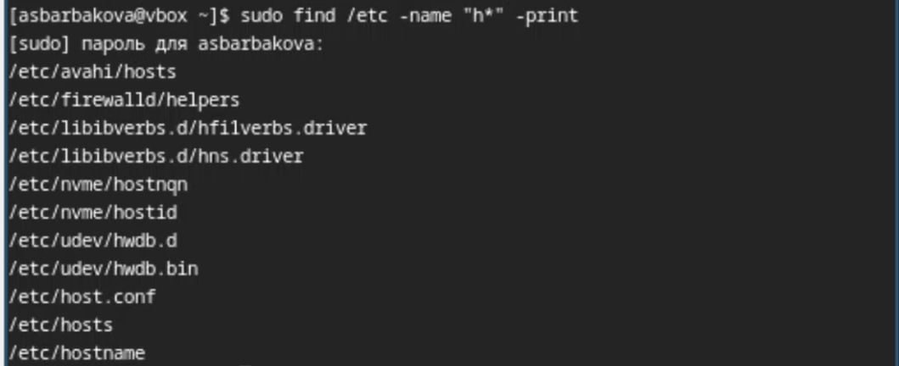

---
## Front matter
title: "Лабораторная №8"
author: "Барбакова Алиса Саяновна"

## Generic otions
lang: ru-RU
toc-title: "Содержание"

## Bibliography
bibliography: bib/cite.bib
csl: pandoc/csl/gost-r-7-0-5-2008-numeric.csl

## Pdf output format
toc: true # Table of contents
toc-depth: 2
lof: true # List of figures
lot: true # List of tables
fontsize: 12pt
linestretch: 1.5
papersize: a4
documentclass: scrreprt
## I18n polyglossia
polyglossia-lang:
  name: russian
  options:
	- spelling=modern
	- babelshorthands=true
polyglossia-otherlangs:
  name: english
## I18n babel
babel-lang: russian
babel-otherlangs: english
## Fonts
mainfont: PT Serif
romanfont: PT Serif
sansfont: PT Sans
monofont: PT Mono
mainfontoptions: Ligatures=TeX
romanfontoptions: Ligatures=TeX
sansfontoptions: Ligatures=TeX,Scale=MatchLowercase
monofontoptions: Scale=MatchLowercase,Scale=0.9
## Biblatex
biblatex: true
biblio-style: "gost-numeric"
biblatexoptions:
  - parentracker=true
  - backend=biber
  - hyperref=auto
  - language=auto
  - autolang=other*
  - citestyle=gost-numeric
## Pandoc-crossref LaTeX customization
figureTitle: "Рис."
tableTitle: "Таблица"
listingTitle: "Листинг"
lofTitle: "Список иллюстраций"
lotTitle: "Список таблиц"
lolTitle: "Листинги"
## Misc options
indent: true
header-includes:
  - \usepackage{indentfirst}
  - \usepackage{float} # keep figures where there are in the text
  - \floatplacement{figure}{H} # keep figures where there are in the text
---

# Цель работы

Ознакомление с инструментами поиска файлов и фильтрации текстовых данных.
Приобретение практических навыков: по управлению процессами (и заданиями), по
проверке использования диска и обслуживанию файловых систем

# Задание

1. Осуществите вход в систему, используя соответствующее имя пользователя.  
2. Запишите в файл file.txt названия файлов, содержащихся в каталоге /etc. Допишите в этот же файл названия файлов, содержащихся в вашем домашнем каталоге.  
3. Выведите имена всех файлов из file.txt, имеющих расширение .conf, после чего запишите их в новый текстовой файл conf.txt.  
4. Определите, какие файлы в вашем домашнем каталоге имеют имена, начинавшиеся с символа c? Предложите несколько вариантов, как это сделать.  
5. Выведите на экран (по странично) имена файлов из каталога /etc, начинающиеся
с символа h.  
6. Запустите в фоновом режиме процесс, который будет записывать в файл ~/logfile
файлы, имена которых начинаются с log.  
7. Удалите файл ~/logfile.  
8. Запустите из консоли в фоновом режиме редактор gedit.  
9. Определите идентификатор процесса gedit, используя команду ps, конвейер и фильтр
grep. Как ещё можно определить идентификатор процесса?  
10. Прочтите справку (man) команды kill, после чего используйте её для завершения
процесса gedit.  
11. Выполните команды df и du, предварительно получив более подробную информацию
об этих командах, с помощью команды man.  
12. Воспользовавшись справкой команды find, выведите имена всех директорий, имеющихся в вашем домашнем каталоге.  

# Теоретическое введение

В системе по умолчанию открыто три специальных потока: – stdin — стандартный поток ввода (по умолчанию: клавиатура), файловый дескриптор 0; – stdout — стандартный поток вывода (по умолчанию: консоль), файловый дескриптор 1; – stderr — стандартный поток вывод сообщений об ошибках (по умолчанию: консоль), файловый дескриптор 2. Большинство используемых в консоли команд и программ записывают результаты своей работы в стандартный поток вывода stdout. Например, команда ls выводит в стан- дартный поток вывода (консоль) список файлов в текущей директории. Потоки вывода и ввода можно перенаправлять на другие файлы или устройства. Проще всего это делается с помощью символов >, >>, <, <<. Конвейер (pipe) служит для объединения простых команд или утилит в цепочки, в которых результат работы предыдущей команды передаётся последующей. Команда find используется для поиска и отображения на экран имён файлов, соответ- ствующих заданной строке символов.

# Выполнение лабораторной работы

Захожу в систему. Записываю в файл file.txt названия файлов, содержащихся в каталоге /etc. Дописываю в этот же файл названия файлов, содержащихся в вашем домашнем каталоге. Вывожу имена всех файлов из file.txt, имеющих расширение .conf, после чего
записываю их в новый текстовой файл conf.txt.(рис. [-@fig:001]). (рис. [-@fig:002])

{#fig:001 width=70%}

{#fig:002 width=70%}

Определяю, какие файлы в домашнем каталоге имеют имена, начинавшиеся с символа c? Предложу 2 варианта, как это сделать. (рис. [-@fig:003]). (рис. [-@fig:004])

{#fig:003 width=70%}

{#fig:004 width=70%}

Вывожу на экран (по странично) имена файлов из каталога /etc, начинающиеся
с символа h. (рис. [-@fig:005]).

{#fig:005 width=70%}

Запускаю в фоновом режиме процесс, который будет записывать в файл ~/logfile
файлы, имена которых начинаются с log. Удаляю файл ~/logfile. (рис. [-@fig:006]).

{#fig:006 width=70%}

Запускаю из консоли в фоновом режиме редактор gedit. Определяю идентификатор процесса gedit, используя команду ps, конвейер и фильтр grep. Читаю справку (man) команды kill, после чего используйте её для завершения процесса gedit. (рис. [-@fig:007]).

{#fig:007 width=70%}

Выполняю команды df и du, предварительно получив более подробную информацию
об этих командах, с помощью man. (рис. [-@fig:008]).

{#fig:008 width=70%}

Воспользовавшись справкой команды find, вывожу имена всех директорий, имеющихся в моём домашнем каталоге. (рис. [-@fig:009]). (рис. [-@fig:010])

{#fig:009 width=70%}

{#fig:010 width=70%}

# Выводы

Мы ознакомились с инструментами поиска файлов и фильтрации текстовых данных. Приобрели практических навыков: по управлению процессами (и заданиями), по проверке использования диска и обслуживанию файловых систем.

# Список литературы{.unnumbered}

1. Кулябов Д. С. Введерние в операционную систему UNIX - Лекция.
2. Таненбаум Э., Бос Х. Современные операционные системы. - 4-е изд. -СПб. : Питер, 2015. - 1120 с.
3.[Архитектура ЭВМ](https://esystem.rudn.ru/pluginfile.php/2586868/mod_resource/content/4/006-lab_proc.pdf)
