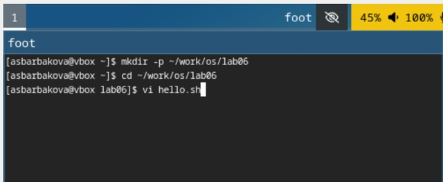
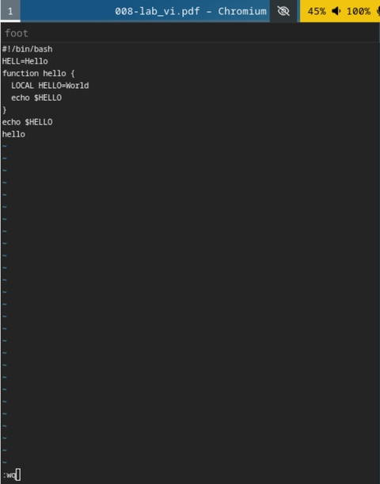
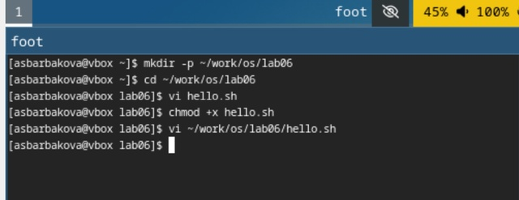
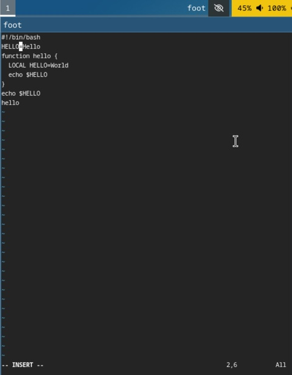
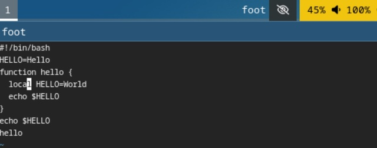
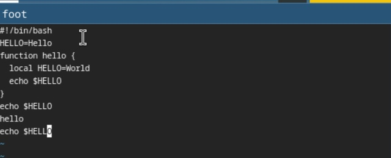
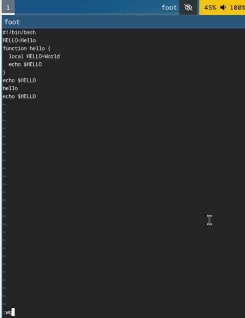

---
## Front matter
lang: ru-RU
title: "Лабораторная работа №10"
author: Барбакова А. С.
  - 
institute:
  - Российский университет дружбы народов, Москва, Россия
  
## i18n babel
babel-lang: russian
babel-otherlangs: english

## Formatting pdf
toc: false
toc-title: Содержание
slide_level: 2
aspectratio: 169
section-titles: true
theme: metropolis
header-includes:
 - \metroset{progressbar=frametitle,sectionpage=progressbar,numbering=fraction}
 - '\makeatletter'
 - '\beamer@ignorenonframefalse'
 - '\makeatother'
---

# Информация

## Докладчик

:::::::::::::: {.columns align=center}
::: {.column width="70%"}

  * Барбакова Алиса Саяновна
  * НКАбд-01-24, студ. билет - 1132246727
  * Российский университет дружбы народов
  * https://github.com/ASBarbakova/study_2024-2025_os-intro

:::
::: {.column width="30%"}

:::
::::::::::::::

## Цель работы

Познакомиться с операционной системой Linux. Получить практические навыки работы с редактором vi, установленным по умолчанию практически во всех дистрибутивах.

## Задание

1. Ознакомиться с теоретическим материалом.
2. Ознакомиться с редактором vi.
3. Выполнить упражнения, используя команды vi.

## Теоретическое введение

В большинстве дистрибутивов Linux в качестве текстового редактора по умолчанию устанавливается интерактивный экранный редактор vi (Visual display editor).
Редактор vi имеет три режима работы:  
 - командный режим — предназначен для ввода команд редактирования и навигации по редактируемому файлу;  
 - режим вставки — предназначен для ввода содержания редактируемого файла;  
 - режим последней (или командной) строки — используется для записи изменений в файл и выхода из редактора.  
 
## Теоретическое введение

Для вызова редактора vi необходимо указать команду vi и имя редактируемого файла: vi <имя_файла>  
При этом в случае отсутствия файла с указанным именем будет создан такой файл.  
Переход в командный режим осуществляется нажатием клавиши Esc . Для выхода из редактора vi необходимо перейти в режим последней строки: находясь в командном режиме, нажать Shift-; (по сути символ : — двоеточие), затем:  
 - набрать символы wq, если перед выходом из редактора требуется записать изменения в файл;  
 - набрать символ q (или q!), если требуется выйти из редактора без сохранения.  

# Выполнение лабораторной работы

## Задание 1

Создаю каталог ~/work/os/lab06, перехожу в него, вызываю vi и создаю файл hello.sh.

{#fig:001 width=70%}

## Задание 1 

Нажимаю на i и ввожу требуемый текст.

{#fig:002 width=70%}

## Задание 1

Выхожу, записываю, делаю файл исполняемым.

{#fig:003 width=70%}

## Задание 2  

Вызываю vi на редактирование файла, устанавливаю курсор в конец слова HELL, в режиме вставки изменяю на HELLO.

## Задание 2

{#fig:004 width=70%}

## Задание 2

Стираю LOCAL в четвёртой строчке, пишу local. 

{#fig:005 width=70%}

## Задание 2

Устанавливаю курсор на последней строке файла, пишу строчку echo $HELLO, удаляю строчку, возвращаю строчку командой u в командном режиме. 

{#fig:006 width=70%}

## Задание 2

Ввожу символ : для перехода в режим последней строки. Записываю произведённые изменения и выхожу из vi. 

## Задание 2

{#fig:007 width=70%}

## Выводы

Познакомилась с операционной системой Linux. Получила практические навыки работы с редактором vi.

## Список литературы{.unnumbered}

1. Кулябов Д. С. Введерние в операционную систему UNIX - Лекция.
2. Таненбаум Э., Бос Х. Современные операционные системы. - 4-е изд. -СПб. : Питер, 2015. - 1120 с.
3. [Архитектура ЭВМ](hhttps://esystem.rudn.ru/pluginfile.php/2586872/mod_resource/content/4/008-lab_vi.pdf)
