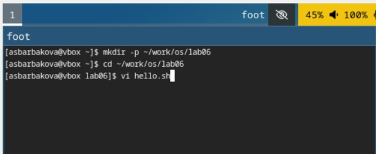
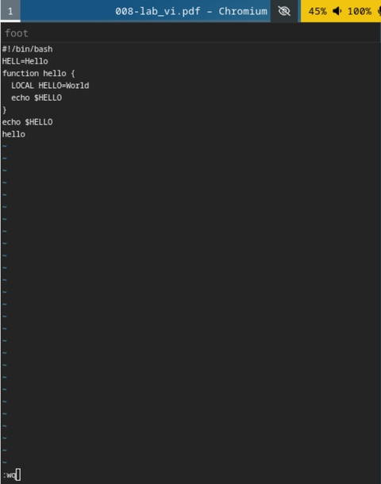
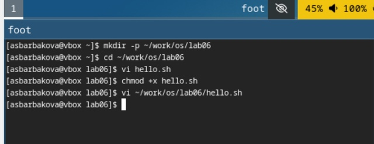
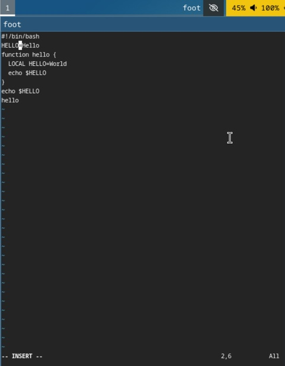
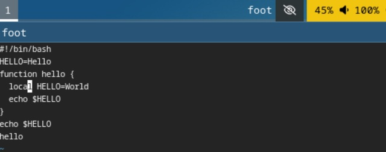
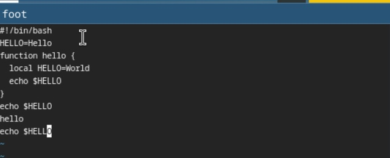
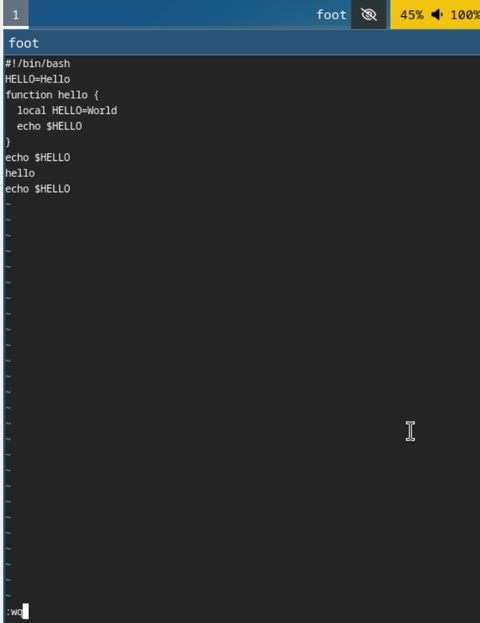

---
## Front matter
title: "Лабораторная работа №10"
author: "Барбакова Алиса Саяновна"

## Generic otions
lang: ru-RU
toc-title: "Содержание"

## Bibliography
bibliography: bib/cite.bib
csl: pandoc/csl/gost-r-7-0-5-2008-numeric.csl

## Pdf output format
toc: true # Table of contents
toc-depth: 2
lof: true # List of figures
lot: true # List of tables
fontsize: 12pt
linestretch: 1.5
papersize: a4
documentclass: scrreprt
## I18n polyglossia
polyglossia-lang:
  name: russian
  options:
	- spelling=modern
	- babelshorthands=true
polyglossia-otherlangs:
  name: english
## I18n babel
babel-lang: russian
babel-otherlangs: english
## Fonts
mainfont: PT Serif
romanfont: PT Serif
sansfont: PT Sans
monofont: PT Mono
mainfontoptions: Ligatures=TeX
romanfontoptions: Ligatures=TeX
sansfontoptions: Ligatures=TeX,Scale=MatchLowercase
monofontoptions: Scale=MatchLowercase,Scale=0.9
## Biblatex
biblatex: true
biblio-style: "gost-numeric"
biblatexoptions:
  - parentracker=true
  - backend=biber
  - hyperref=auto
  - language=auto
  - autolang=other*
  - citestyle=gost-numeric
## Pandoc-crossref LaTeX customization
figureTitle: "Рис."
tableTitle: "Таблица"
listingTitle: "Листинг"
lofTitle: "Список иллюстраций"
lotTitle: "Список таблиц"
lolTitle: "Листинги"
## Misc options
indent: true
header-includes:
  - \usepackage{indentfirst}
  - \usepackage{float} # keep figures where there are in the text
  - \floatplacement{figure}{H} # keep figures where there are in the text
---

# Цель работы

Познакомиться с операционной системой Linux. Получить практические навыки работы с редактором vi, установленным по умолчанию практически во всех дистрибутивах.

# Задание

1. Ознакомиться с теоретическим материалом.
2. Ознакомиться с редактором vi.
3. Выполнить упражнения, используя команды vi.

# Теоретическое введение

В большинстве дистрибутивов Linux в качестве текстового редактора по умолчанию устанавливается интерактивный экранный редактор vi (Visual display editor).
Редактор vi имеет три режима работы:  
 - командный режим — предназначен для ввода команд редактирования и навигации по редактируемому файлу;
 - режим вставки — предназначен для ввода содержания редактируемого файла;
 - режим последней (или командной) строки — используется для записи изменений в файл и выхода из редактора.
Для вызова редактора vi необходимо указать команду vi и имя редактируемого файла: vi <имя_файла>  
При этом в случае отсутствия файла с указанным именем будет создан такой файл.  
Переход в командный режим осуществляется нажатием клавиши Esc . Для выхода из редактора vi необходимо перейти в режим последней строки: находясь в командном режиме, нажать Shift-; (по сути символ : — двоеточие), затем:
 - набрать символы wq, если перед выходом из редактора требуется записать изменения в файл;
 - набрать символ q (или q!), если требуется выйти из редактора без сохранения.

# Выполнение лабораторной работы

Создаю каталог ~/work/os/lab06, перехожу в него, вызываю vi и создаю файл hello.sh. (рис. [-@fig:001]).

Задание 1  

{#fig:001 width=70%}

Нажимаю на i и ввожу требуемый текст (рис. [-@fig:002])

{#fig:002 width=70%}

Выхожу, записываю, делаю файл исполняемым. (рис. [-@fig:003])

{#fig:003 width=70%}

Задание 2  

Вызываю vi на редактирование файла, устанавливаю курсор в конец слова HELL, в режиме вставки изменяю на HELLO. (рис. [-@fig:004])

{#fig:004 width=70%}

Стираю LOCAL в четвёртой строчке, пишу local. (рис. [-@fig:005])

{#fig:005 width=70%}

Устанавливаю курсор на последней строке файла, пишу строчку echo $HELLO, удаляю строчку, возвращаю строчку командой u в командном режиме. (рис. [-@fig:006])

{#fig:006 width=70%}

Ввожу символ : для перехода в режим последней строки. Записываю произведённые изменения и выхожу из vi. (рис. [-@fig:007])

{#fig:007 width=70%}

# Выводы

Познакомилась с операционной системой Linux. Получила практические навыки работы с редактором vi.

# Список литературы{.unnumbered}

1. Кулябов Д. С. Введерние в операционную систему UNIX - Лекция.
2. Таненбаум Э., Бос Х. Современные операционные системы. - 4-е изд. -СПб. : Питер, 2015. - 1120 с.
3.[Архитектура ЭВМ](hhttps://esystem.rudn.ru/pluginfile.php/2586872/mod_resource/content/4/008-lab_vi.pdf)
