---
## Front matter
title: "Лабораторная работа №11"
author: "Барбакова Алиса Саяновна"

## Generic otions
lang: ru-RU
toc-title: "Содержание"

## Bibliography
bibliography: bib/cite.bib
csl: pandoc/csl/gost-r-7-0-5-2008-numeric.csl

## Pdf output format
toc: true # Table of contents
toc-depth: 2
lof: true # List of figures
lot: true # List of tables
fontsize: 12pt
linestretch: 1.5
papersize: a4
documentclass: scrreprt
## I18n polyglossia
polyglossia-lang:
  name: russian
  options:
	- spelling=modern
	- babelshorthands=true
polyglossia-otherlangs:
  name: english
## I18n babel
babel-lang: russian
babel-otherlangs: english
## Fonts
mainfont: PT Serif
romanfont: PT Serif
sansfont: PT Sans
monofont: PT Mono
mainfontoptions: Ligatures=TeX
romanfontoptions: Ligatures=TeX
sansfontoptions: Ligatures=TeX,Scale=MatchLowercase
monofontoptions: Scale=MatchLowercase,Scale=0.9
## Biblatex
biblatex: true
biblio-style: "gost-numeric"
biblatexoptions:
  - parentracker=true
  - backend=biber
  - hyperref=auto
  - language=auto
  - autolang=other*
  - citestyle=gost-numeric
## Pandoc-crossref LaTeX customization
figureTitle: "Рис."
tableTitle: "Таблица"
listingTitle: "Листинг"
lofTitle: "Список иллюстраций"
lotTitle: "Список таблиц"
lolTitle: "Листинги"
## Misc options
indent: true
header-includes:
  - \usepackage{indentfirst}
  - \usepackage{float} # keep figures where there are in the text
  - \floatplacement{figure}{H} # keep figures where there are in the text
---
# Цель работы

Познакомиться с операционной системой Linux. Получить практические навыки рабо-
ты с редактором Emacs

# Задание

1. Ознакомиться с теоретическим материалом.  
2. Ознакомиться с редактором emacs.  
3. Выполнить упражнения.  
4. Ответить на контрольные вопросы  

# Теоретическое введение

Emacs представляет собой мощный экранный редактор текста, написанный на языке высокого уровня Elisp.

# Выполнение лабораторной работы

1. Устанавливаю emacs (рис. [-@fig:001])

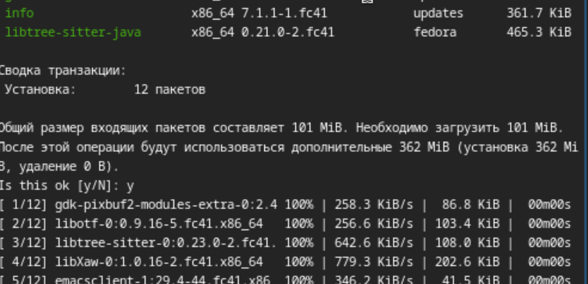{#fig:001 width=70%}

Открываю emacs (рис. [-@fig:002]).

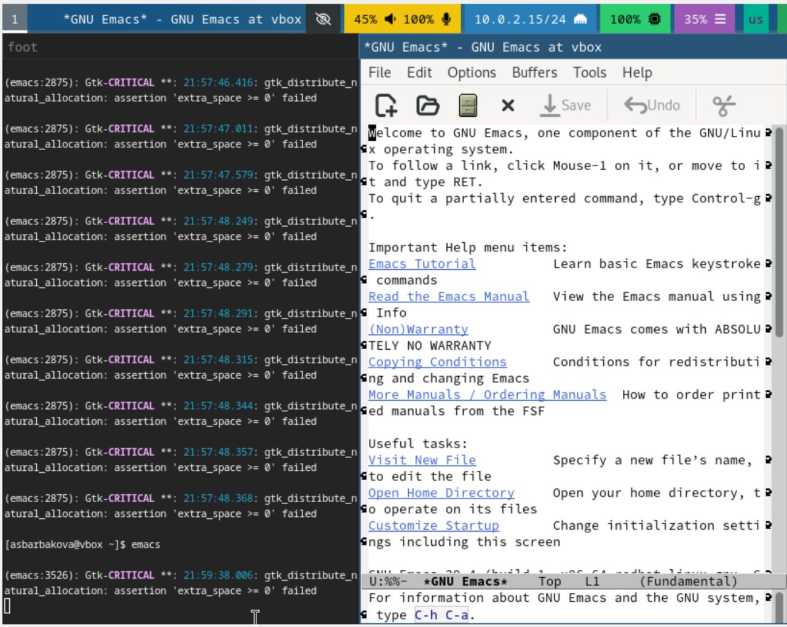{#fig:002 width=70%}

2. Создаю файл lab11.sh (рис. [-@fig:003]).

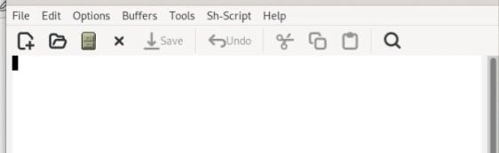{#fig:003 width=70%}

3. Набираю нужный текст (рис. [-@fig:004]).

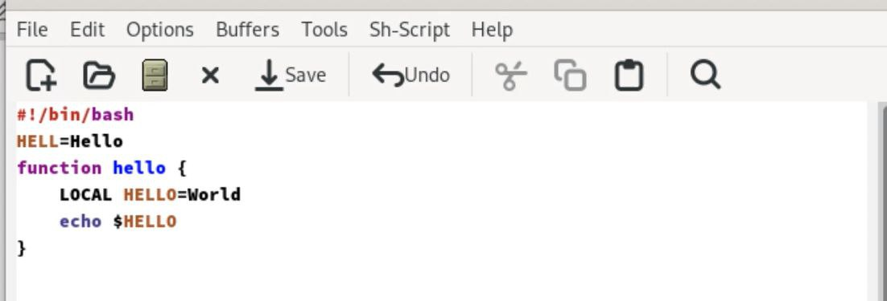{#fig:004 width=70%}

4. Сохраняю файл.

5. Проделываю с текстом стандартные процедуры редактирования, осуществляя каждое действие комбинацией клавиш:

    1. Вырезать одной командой целую строку (С-k).
    
    2. Вставить эту строку в конец файла (C-y).
    
    4. Скопировать область в буфер обмена (M-w).
    
    5. Вставить область в конец файла.
    
    6. Вновь выделить эту область и на этот раз вырезать её (C-w).
    
    7. Отмените последнее действие (C-/).

(рис. [-@fig:005]), (рис. [-@fig:006]), (рис. [-@fig:007]), (рис. [-@fig:008]), (рис. [-@fig:009]), (рис. [-@fig:010]), (рис. [-@fig:011]).

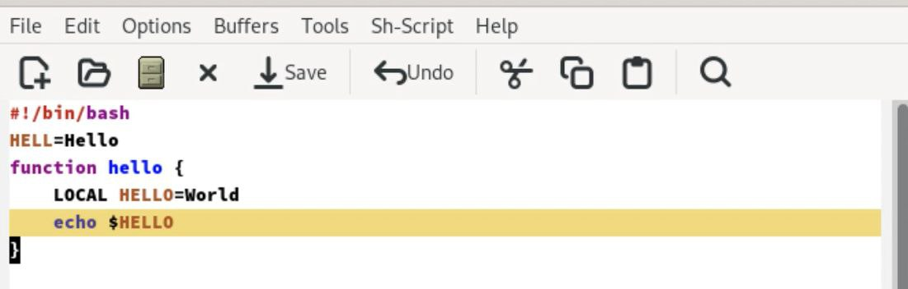{#fig:005 width=70%}

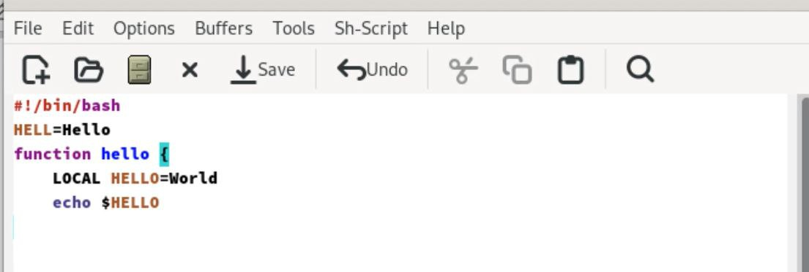{#fig:006 width=70%}

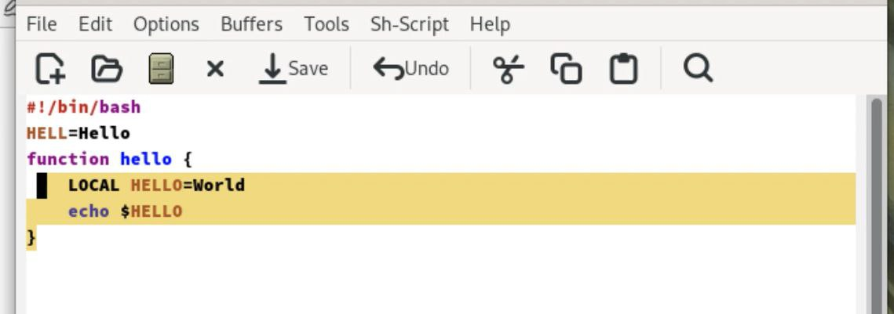{#fig:007 width=70%}

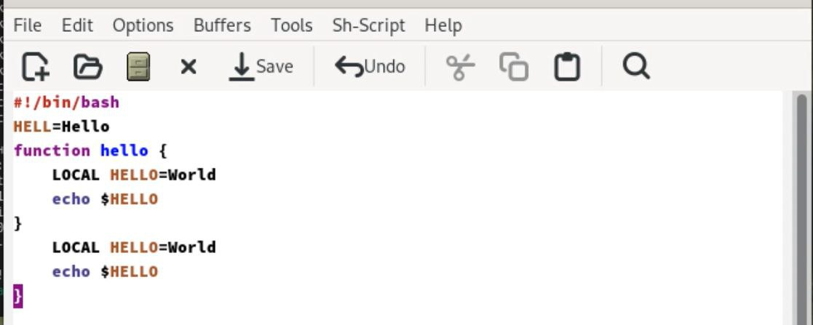{#fig:008 width=70%}

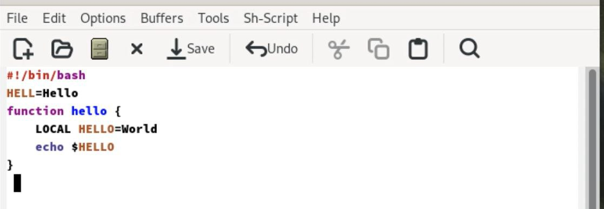{#fig:009 width=70%}

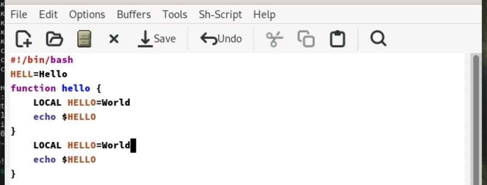{#fig:010 width=70%}

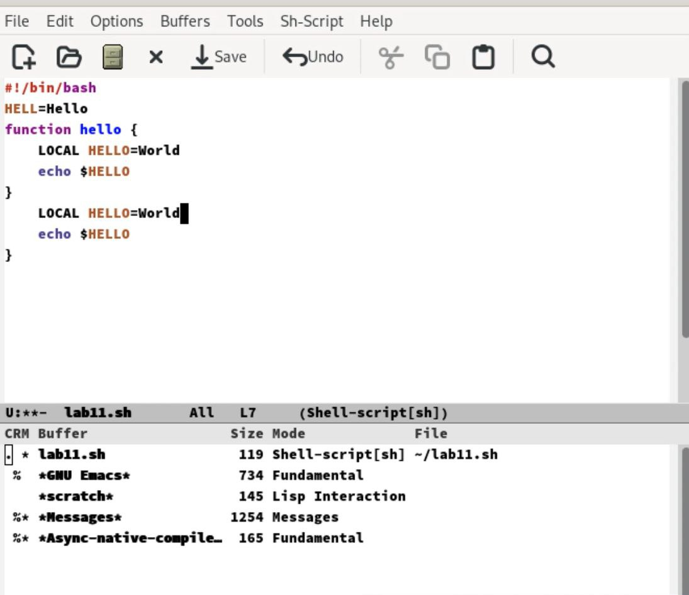{#fig:011 width=70%}

6. Учусь пользоваться командами по перемещению курсора.

7. Управление буферами:

    1. Вывести список активных буферов на экран (C-x C-b).

    2. Переместитесь во вновь открытое окно (C-x) o со списком открытых буферов
    и переключитесь на другой буфер.
    
    3. Закройте это окно (C-x 0).
    
    4. Теперь вновь переключайтесь между буферами, но уже без вывода их списка на экран (C-x b).
    
(рис. [-@fig:012]).

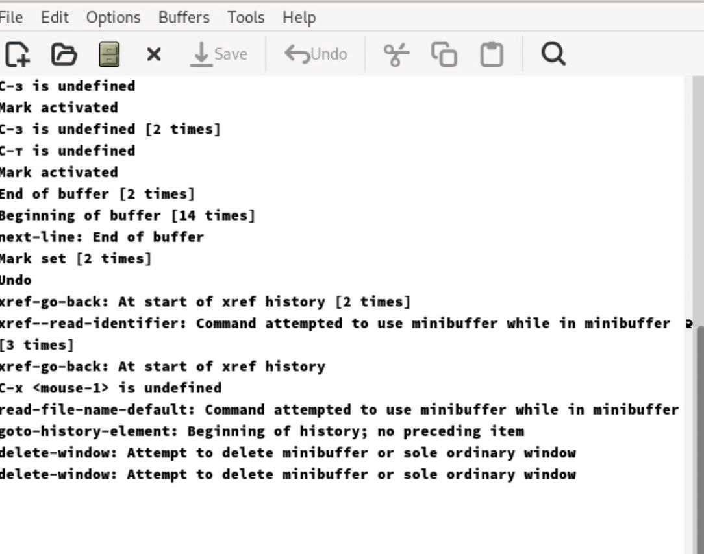{#fig:012 width=70%}

8. Управление окнами:

    1. Поделите фрейм на 4 части: разделите фрейм на два окна по вертикали (C-x 3), а затем каждое из этих окон на две части по горизонтали (C-x 2)

    2. В каждом из четырёх созданных окон откройте новый буфер (файл) и введите
несколько строк текста.

(рис. [-@fig:013]), (рис. [-@fig:014]).

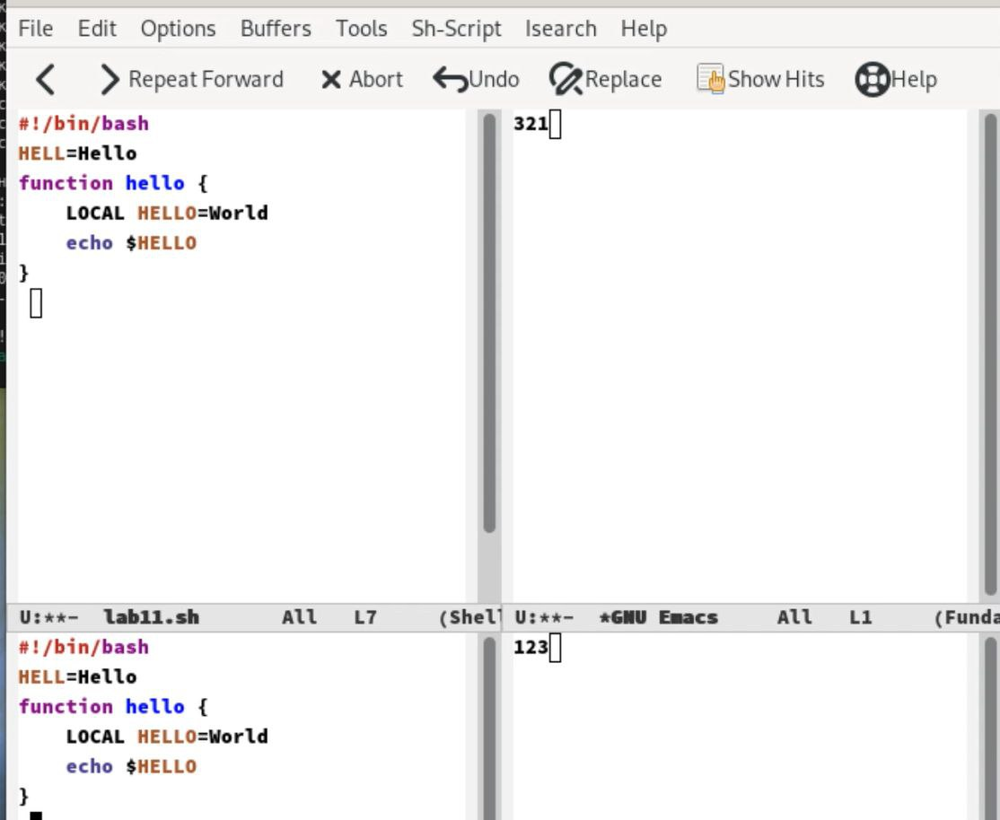{#fig:013 width=70%}

{#fig:014 width=70%}

9. Режим поиска:

    1. Переключитесь в режим поиска (C-s) и найдите несколько слов, присутствующих в тексте.

    2. Переключайтесь между результатами поиска, нажимая C-s.

    3. Выйдите из режима поиска, нажав C-g.

    4. Перейдите в режим поиска и замены (M-%), введите текст, который следует найти и заменить, нажмите Enter , затем введите текст для замены. После того как будут подсвечены результаты поиска, нажмите ! для подтверждения замены.

    5. Испробуйте другой режим поиска, нажав M-s o. Объясните, чем он отличается от обычного режима? Ответ - это режим поиска построчно.

(рис. [-@fig:015]).

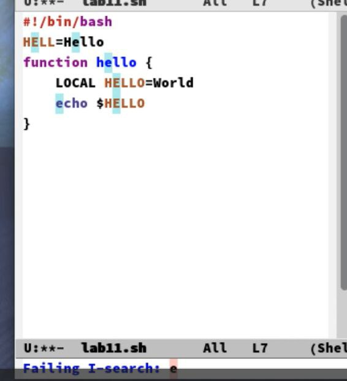{#fig:015 width=70%}

# Выводы

Я познакомилась с операционной системой Linux. Получила практические навыки рабо-
ты с редактором Emacs

# Список литературы{.unnumbered}

1. Кулябов Д. С. Введерние в операционную систему UNIX - Лекция.
2. Таненбаум Э., Бос Х. Современные операционные системы. - 4-е изд. -СПб. : Питер, 2015. - 1120 с.
3. [Архитектура ЭВМ](https://esystem.rudn.ru/pluginfile.php/2586874/mod_resource/content/5/009-lab_emacs.pdf)
