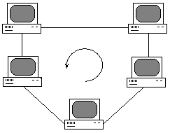

---
## Front matter
lang: ru-RU
title: "Операционные системы. Лекция 6"
subtitle: "Доклад на тему Обзор сетевых топологий"
author: Барбакова А. С.
  - 
institute:
  - Российский университет дружбы народов, Москва, Россия
  
## i18n babel
babel-lang: russian
babel-otherlangs: english

## Formatting pdf
toc: false
toc-title: Содержание
slide_level: 2
aspectratio: 169
section-titles: true
theme: metropolis
header-includes:
 - \metroset{progressbar=frametitle,sectionpage=progressbar,numbering=fraction}
 - '\makeatletter'
 - '\beamer@ignorenonframefalse'
 - '\makeatother'
---

# Информация

## Докладчик

:::::::::::::: {.columns align=center}
::: {.column width="70%"}

  * Барбакова Алиса Саяновна
  * НКАбд-01-24, студ. билет - 1132246727
  * Российский университет дружбы народов
  * https://github.com/ASBarbakova/study_2024-2025_os-intro
  * Преподаватель: Кулябов Дмитрий Сергеевич
  * д.ф.-м.н., профессор
  * профессор кафедры прикладной информатики и теории вероятностей

:::
::: {.column width="30%"}

:::
::::::::::::::

# Введение

Сетевая тополо́гия — это конфигурация графа, вершинам которого соответствуют конечные узлы сети (компьютеры и коммуникационное оборудование (маршрутизаторы), а рёбрам — физические или информационные связи между вершинами.  

Сетевая топология может быть  

   - физической — описывает реальное расположение и связи между узлами сети.  
   - логической — описывает хождение сигнала в рамках физической топологии.  
   - информационной — описывает направление потоков информации, передаваемой по сети.  
   - управления обменом — это принцип передачи права на пользование сетью.  
   
## Актуальность

Сетевые топологии являются фундаментом построения современных компьютерных сетей. Их выбор определяет производительность, надежность, масштабируемость и стоимость эксплуатации сети. В условиях стремительного развития интернета вещей (IoT), облачных технологий и распределенных вычислений понимание преимуществ и недостатков различных топологий становится критически важным.

# Топологии

## Полносвязные

Сеть, в которой каждый компьютер непосредственно связан со всеми остальными.

{#fig:001 width=70%}

## Неполносвязные

Неполносвязных топологий существует несколько. В них, в отличие от полносвязных, может применяться передача данных не напрямую между компьютерами, а через дополнительные узлы. Основные из них: Шина, Звезда, Кольцо.

## Шина

{#fig:002 width=70%}

Преимущества сетей шинной топологии:  

   - расход кабеля существенно уменьшен  
   - отказ одного из узлов не влияет на работу сети в целом;  
   - сеть легко настраивать и конфигурировать;  
   - сеть устойчива к неисправностям отдельных узлов.  
   
##

Недостатки сетей шинной топологии:  

   - разрыв кабеля может повлиять на работу всей сети;  
   - ограниченная длина кабеля и количество рабочих станций;  
   - недостаточная надёжность сети из-за проблем с разъёмами кабеля;  
   - низкая производительность, обусловлена разделением канала между всеми абонентами.  
   
## Звезда    
    
{#fig:003 width=70%}

Данная топология применяется в локальных сетях с архитектурой 10Base-T Ethernet.  

## Звезда

Преимущества сетей топологии звезда:  

   - легко подключить новый ПК;  
   - имеется возможность централизованного управления;  
   - сеть устойчива к неисправностям отдельных ПК и к разрывам соединения отдельных ПК.  

Недостатки сетей топологии звезда:  

   - отказ хаба влияет на работу всей сети;  
   - большой расход кабеля и высокая цена.  
 
## Кольцо

{#fig:004 width=70%}

## Кольцо

Преимущества сетей топологии кольцо:  

   - быстрое создание и настройка этой топологии локальных сетей;  
   - легкое масштабирование  
   - большое количество возможных абонентов.  
   - устойчивость к перегрузкам и отсутствие сетевых конфликтов.  
   - возможность увеличения сети до огромных размеров за счет ретрансляции сигнала между компьютерами.  
   
## Кольцо
   
Недостатки сетей топологии кольцо:  

   - каждая рабочая станция должна активно участвовать в пересылке информации; в случае выхода из строя хотя бы одной из них или обрыва кабеля – работа всей сети останавливается;  
   - подключение новой рабочей станции требует краткосрочного выключения сети;  
   - сложность конфигурирования и настройки;  
   - сложность поиска неисправностей.  

Как правило, в чистом виде топология «кольцо» не применяется из-за своей ненадёжности, поэтому на практике применяются различные модификации кольцевой топологии.  

## Смешанная топология

{#fig:005 width=70%}

## Смешанная топология

Смешанная топология — сетевая топология, преобладающая в крупных сетях с произвольными связями между компьютерами. В таких сетях можно выделить отдельные произвольно связанные фрагменты (подсети), имеющие типовую топологию, поэтому их называют сетями со смешанной топологией. 

## Вывод и практическое применение

В докладе были рассмотрены основные типы сетевых топологий: полносвязные, неполносвязные(шина, звезда, кольцо и смешанные). Каждая из них обладает уникальными характеристиками, определяющими их применение в различных сценариях.  

Оптимальный выбор топологии зависит от требований к скорости, надежности, стоимости развертывания и масштабируемости сети.  

## Вывод и практическое применение

1. Корпоративные сети – топология "звезда" часто применяется в офисах благодаря простоте администрирования и отказоустойчивости.  

2. Промышленные сети и IoT – кольцевые и смешанные топологии обеспечивают устойчивость в системах автоматизации.  

3. Дата-центры и облачные сервисы – полносвязные и смешанные схемы повышают отказоустойчивость и скорость обмена данными.  

4. Домашние сети – шина или звезда (через Wi-Fi-роутер) обеспечивают простую и экономичную организацию.  

## Источники{.unnumbered}

1. [Топологии локальных сетей](http://www.vadzhra.ru/topology_of_local_networks.html)
2. [Сетевая топология](https://ru.ruwiki.ru/wiki/%D0%A1%D0%B5%D1%82%D0%B5%D0%B2%D0%B0%D1%8F_%D1%82%D0%BE%D0%BF%D0%BE%D0%BB%D0%BE%D0%B3%D0%B8%D1%8F)
