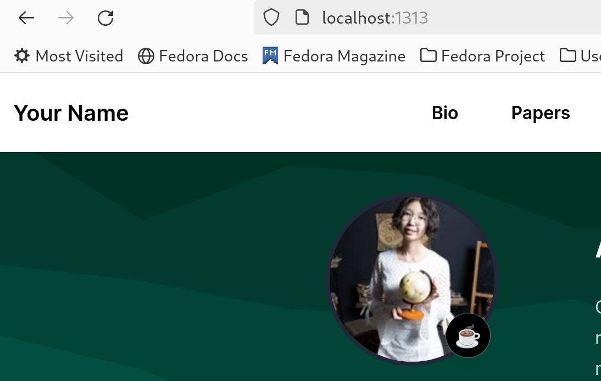
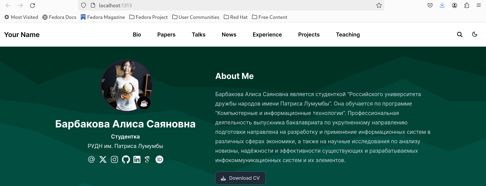
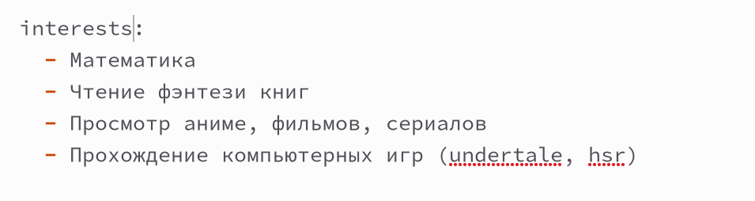
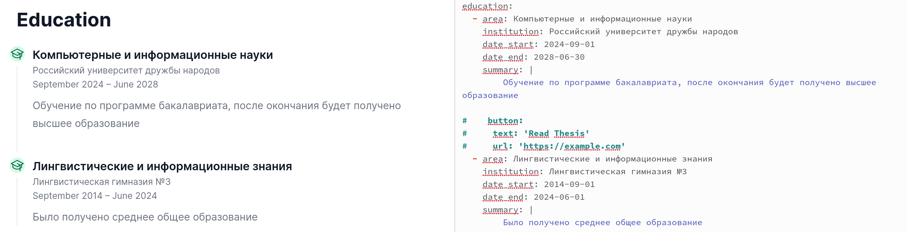
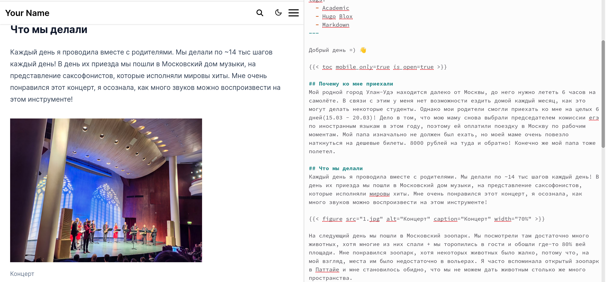
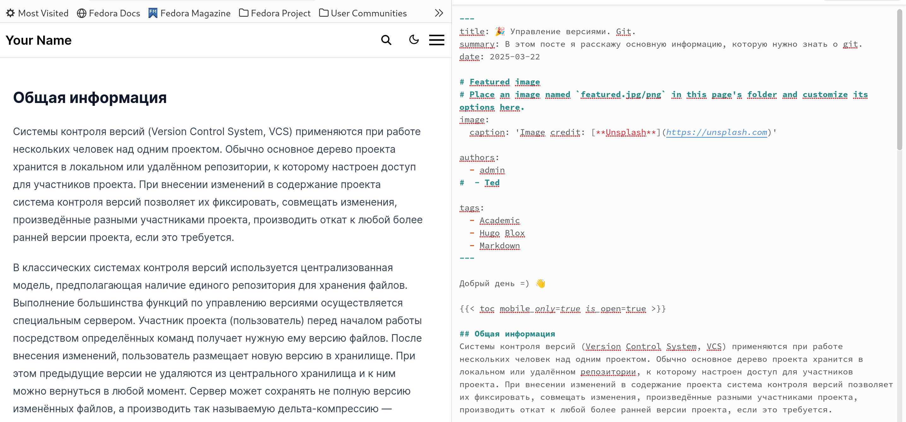
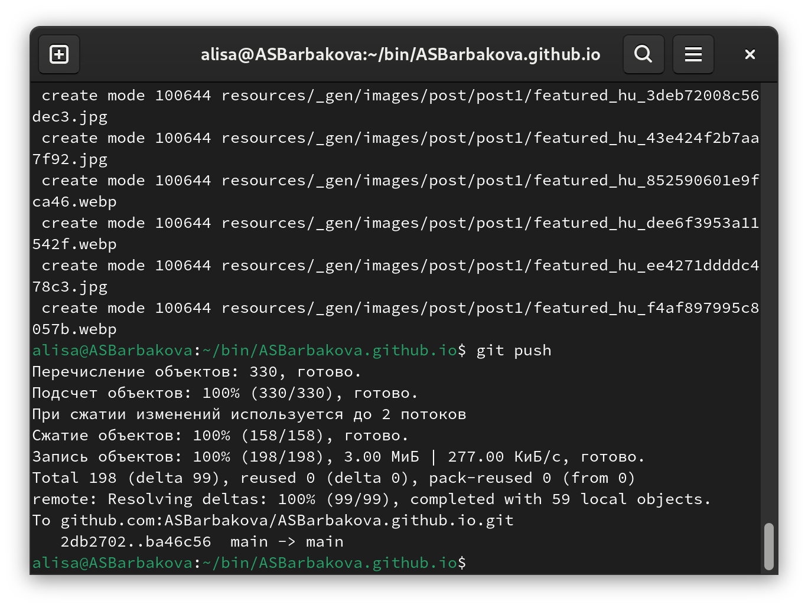
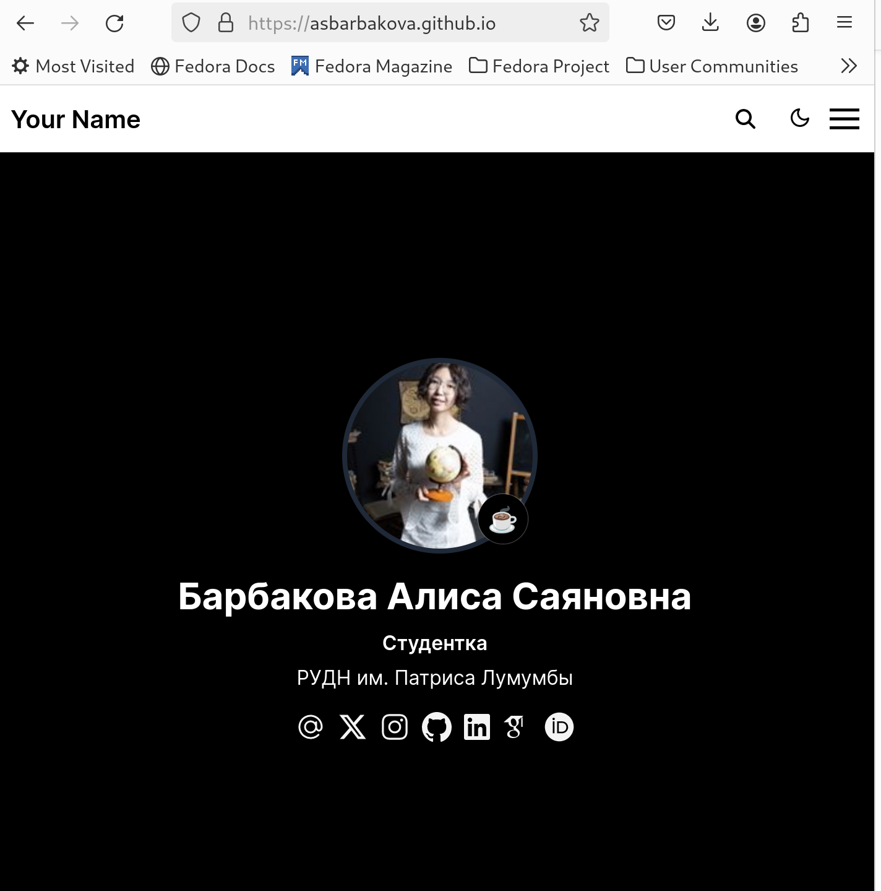

---
## Front matter
lang: ru-RU
title: Индивидуальный проект
subtitle: Этап 2
author: Барбакова А. С.
  - 
institute:
  - Российский университет дружбы народов, Москва, Россия
  
## i18n babel
babel-lang: russian
babel-otherlangs: english

## Formatting pdf
toc: false
toc-title: Содержание
slide_level: 2
aspectratio: 169
section-titles: true
theme: metropolis
header-includes:
 - \metroset{progressbar=frametitle,sectionpage=progressbar,numbering=fraction}
 - '\makeatletter'
 - '\beamer@ignorenonframefalse'
 - '\makeatother'
---

# Информация

## Докладчик

:::::::::::::: {.columns align=center}
::: {.column width="70%"}

  * Барбакова Алиса Саяновна
  * НКАбд-01-24, студ. билет - 1132246727
  * Российский университет дружбы народов
  * https://github.com/ASBarbakova/study_2024-2025_os-intro

:::

:::
::::::::::::::

# Выполнение 2-го этапа Индивидуального Проекта

## Цель работы

- Добавить к сайту данные о себе

## Задачи

- Список добавляемых данных.  
    1) Разместить фотографию владельца сайта.  
    2) Разместить краткое описание владельца сайта (Biography).  
    3) Добавить информацию об интересах (Interests).  
    4) Добавить информацию от образовании (Education).  
- Сделать пост по прошедшей неделе.  
- Добавить пост на тему по выбору:  
    - Управление версиями. Git.  
    - Непрерывная интеграция и непрерывное развертывание (CI/CD).  

# Выполнение лабораторной работы
## Аватарка к сайту
Делаю аватарку моему сайту.

{#fig:001 width=70%}

## Биография
В файл -index.md, в каталоге admin вписываю свою биографию.

{#fig:002 width=70%}

## Интересы
Добавляю в этот же файл md свои интересы.

{#fig:003 width=70%}

## Образование
Добавляю информацию о своём образовании.

{#fig:004 width=70%}

## Пост о прошедшей недели
Открываю каталог bin/blog/content/post. Создаю новую папку post1, копирую файл маркдаун -intdex.md из get-started. Начинаю редактирование, создаю пост о прошедшей недели.

{#fig:005 width=70%}

## Пост на тему "Управление версиями. Git."
Создаю другую папку в том же каталоге и пишу другой пост аналогично. Выбранная тема - Управление версиями. Git.

{#fig:006 width=70%}

## Отправка на гитхаб
Выхожу из ~/bin/hugo server с помощью ctrl+c. Ввожу в терминал git add, git commit и git push.

{#fig:007 width=70%}

## Сайт
Проверяю существование сайта.

{#fig:008 width=70%}

# Выводы

Данные к сайту были добавлены.

# Список литературы{.unnumbered}

1. Кулябов Д. С. Введерние в операционную систему UNIX - Лекция.
2. Таненбаум Э., Бос Х. Современные операционные системы. - 4-е изд. -СПб. : Питер, 2015. - 1120 с.
3. [Архитектура ЭВМ](https://esystem.rudn.ru/mod/page/view.php?id=1224358)

