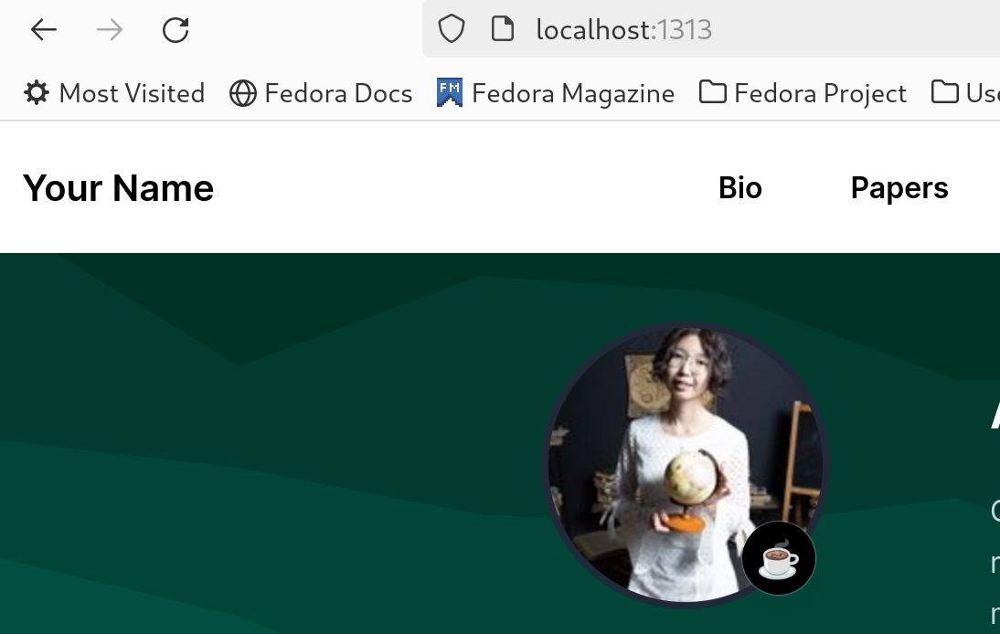
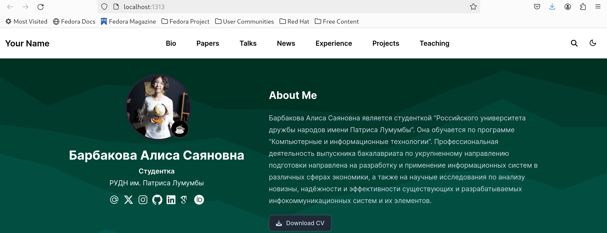
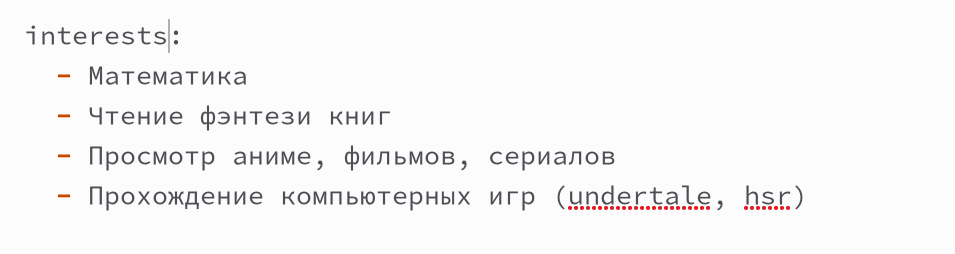
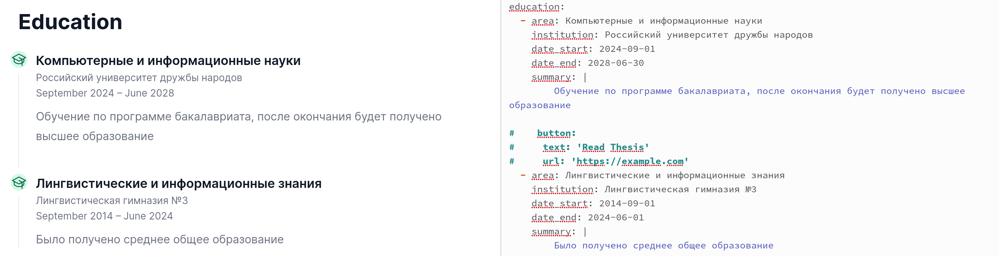
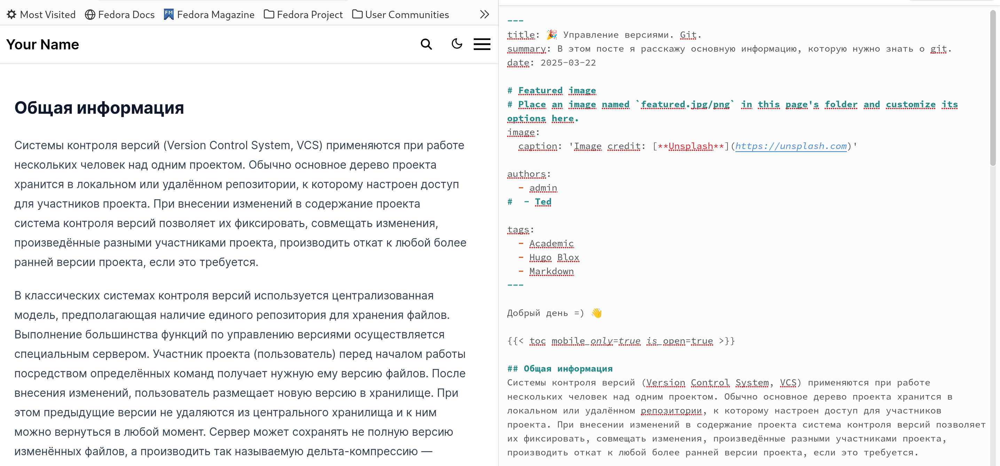
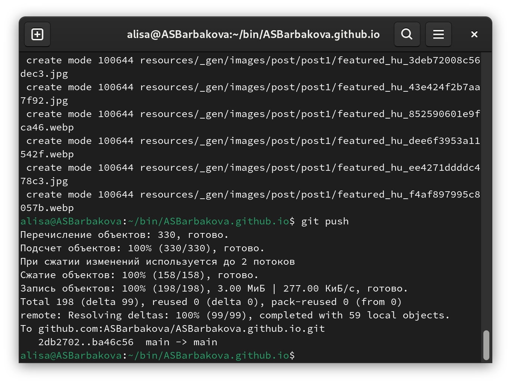
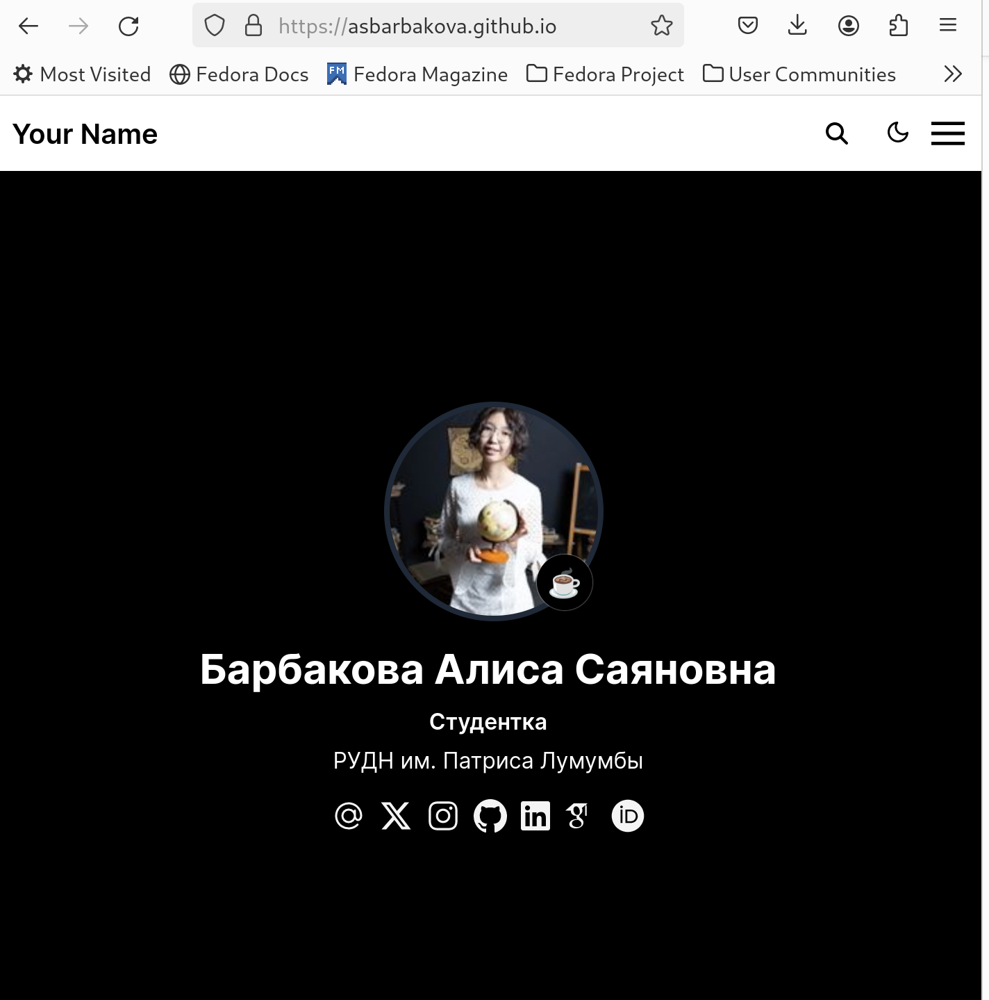

---
## Front matter
title: "Отчёт по индивидуальному проекту, этап 2"
author: "Барбакова Алиса Саяновна"

## Generic otions
lang: ru-RU
toc-title: "Содержание"

## Bibliography
bibliography: bib/cite.bib
csl: pandoc/csl/gost-r-7-0-5-2008-numeric.csl

## Pdf output format
toc: true # Table of contents
toc-depth: 2
lof: true # List of figures
lot: true # List of tables
fontsize: 12pt
linestretch: 1.5
papersize: a4
documentclass: scrreprt
## I18n polyglossia
polyglossia-lang:
  name: russian
  options:
	- spelling=modern
	- babelshorthands=true
polyglossia-otherlangs:
  name: english
## I18n babel
babel-lang: russian
babel-otherlangs: english
## Fonts
mainfont: PT Serif
romanfont: PT Serif
sansfont: PT Sans
monofont: PT Mono
mainfontoptions: Ligatures=TeX
romanfontoptions: Ligatures=TeX
sansfontoptions: Ligatures=TeX,Scale=MatchLowercase
monofontoptions: Scale=MatchLowercase,Scale=0.9
## Biblatex
biblatex: true
biblio-style: "gost-numeric"
biblatexoptions:
  - parentracker=true
  - backend=biber
  - hyperref=auto
  - language=auto
  - autolang=other*
  - citestyle=gost-numeric
## Pandoc-crossref LaTeX customization
figureTitle: "Рис."
tableTitle: "Таблица"
listingTitle: "Листинг"
lofTitle: "Список иллюстраций"
lotTitle: "Список таблиц"
lolTitle: "Листинги"
## Misc options
indent: true
header-includes:
  - \usepackage{indentfirst}
  - \usepackage{float} # keep figures where there are in the text
  - \floatplacement{figure}{H} # keep figures where there are in the text
---

# Цель работы

Добавить к сайту данные о себе.

# Задание

- Список добавляемых данных.  
    1) Разместить фотографию владельца сайта.  
    2) Разместить краткое описание владельца сайта (Biography).  
    3) Добавить информацию об интересах (Interests).  
    4) Добавить информацию от образовании (Education).  
- Сделать пост по прошедшей неделе.  
- Добавить пост на тему по выбору:  
    - Управление версиями. Git.  
    - Непрерывная интеграция и непрерывное развертывание (CI/CD).  

# Выполнение лабораторной работы

Выбираю картинку, переименовываю её в avatar. Теперь это аватарка моего сайта (рис. [-@fig:001]).

{#fig:001 width=70%}

Открываем файл -index.md в каталоге admin, здесь будем добавлять информацию о себе. Вписываю свою биографию (рис. [-@fig:002]).

{#fig:002 width=70%}

Добавляю в этот же файл md свои интересы (рис. [-@fig:003]).

{#fig:003 width=70%}

Добавляю информацию о своём образовании (рис. [-@fig:004]).

{#fig:004 width=70%}

Открываю каталог bin/blog/content/post. Создаю новую папку post1, копирую файл маркдаун -intdex.md из get-started. Начинаю редактирование, создаю пост о прошедшей недели. (рис. [-@fig:005]).

{#fig:005 width=70%}

Создаю другую папку в том же каталоге и пишу другой пост аналогично. Выбранная тема - Управление версиями. Git. Управление версиями. Git. (рис. [-@fig:006]).

{#fig:006 width=70%}

Выхожу из ~/bin/hugo server с помощью ctrl+c. Ввожу в терминал git add, git commit и git push (рис. [-@fig:007]).

{#fig:007 width=70%}

Сайт создался (рис. [-@fig:008]).

{#fig:008 width=70%}

# Выводы

Данные к сайту были добавлены.

# Список литературы{.unnumbered}

1. Кулябов Д. С. Введерние в операционную систему UNIX - Лекция.
2. Таненбаум Э., Бос Х. Современные операционные системы. - 4-е изд. -СПб. : Питер, 2015. - 1120 с.
3. [Архитектура ЭВМ](https://esystem.rudn.ru/mod/page/view.php?id=1224358)
