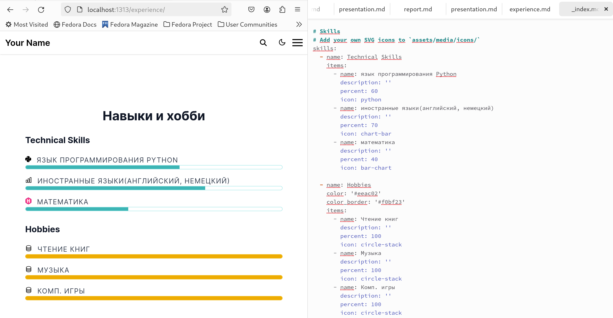
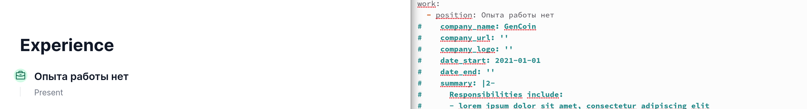
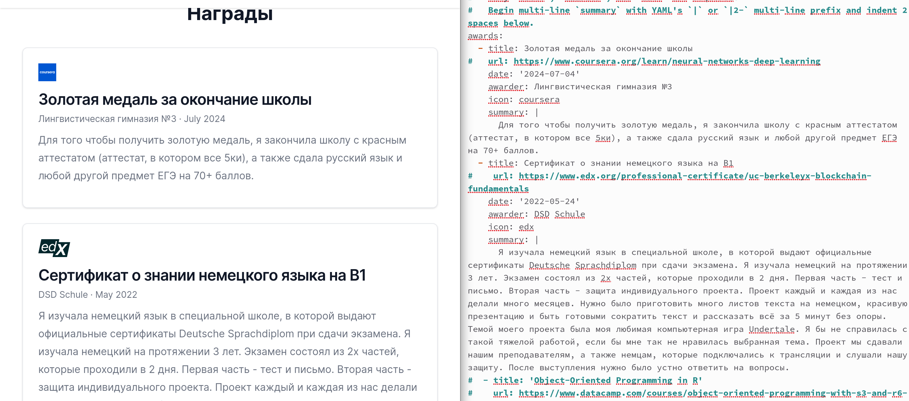
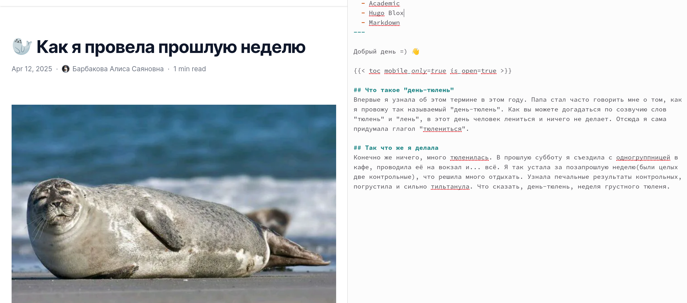
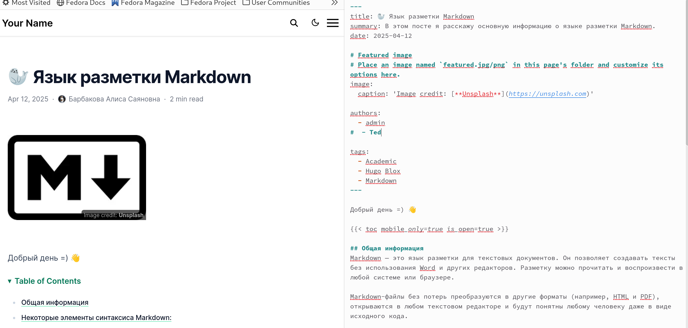

---
## Front matter
lang: ru-RU
title: "Индивидуальный проект"
subtitle: "3 этап"
author: Барбакова А. С.
  - 
institute:
  - Российский университет дружбы народов, Москва, Россия
  
## i18n babel
babel-lang: russian
babel-otherlangs: english

## Formatting pdf
toc: false
toc-title: Содержание
slide_level: 2
aspectratio: 169
section-titles: true
theme: metropolis
header-includes:
 - \metroset{progressbar=frametitle,sectionpage=progressbar,numbering=fraction}
 - '\makeatletter'
 - '\beamer@ignorenonframefalse'
 - '\makeatother'
---

# Информация

## Докладчик

:::::::::::::: {.columns align=center}
::: {.column width="70%"}

  * Барбакова Алиса Саяновна
  * НКАбд-01-24, студ. билет - 1132246727
  * Российский университет дружбы народов
  * https://github.com/ASBarbakova/study_2024-2025_os-intro

:::
::: {.column width="30%"}

:::
::::::::::::::

## Цель работы

Добавить к сайту достижения

## Задание
1. Список достижений.
   - Добавить информацию о навыках (Skills).  
   - Добавить информацию об опыте (Experience).  
   - Добавить информацию о достижениях (Accomplishments).  
2. Сделать пост по прошедшей неделе.  
3. Добавить пост на тему по выбору:
   - Легковесные языки разметки.  
   - Языки разметки. LaTeX.  
   - Язык разметки Markdown.  

# Выполнение индивидуального проекта

## Навыки и хобби

Захожу в терминал, ввожу команду ~/bin/blog server. У меня открывается localhost, на котором я могу смотреть мои изменения с сайтом. В папке открываю файл md, ввожу туда информацию о моих навыках и хобби.

##

{#fig:001 width=70%}

## Опыт работы

Там же редактирую информацио об опыте.

{#fig:002 width=70%}

## Достижения(награды)

И добавляю информацию о достижениях.

{#fig:003 width=70%}

## Пост по прошедшей неделе 

Захожу в другой каталог, создаю новую папку для поста по прошедшей неделе. Пишу пост.

{#fig:004 width=70%}

## Пост на тему "Язык разметки Markdown"

Там же создаю другую папку, пишу пост по выбранной теме - "Язык разметки Markdown."

{#fig:005 width=70%} 

## Выводы

Достижения к сайту были добавлены.

## Список литературы{.unnumbered}

1. Кулябов Д. С. Введерние в операционную систему UNIX - Лекция.
2. Таненбаум Э., Бос Х. Современные операционные системы. - 4-е изд. -СПб. : Питер, 2015. - 1120 с.
